summary: Case Study with Apple
id: wv-m11-case-study
categories: web-development
tags: web-development
status: Published
authors: Vinh Duong
Feedback Link: https://www.coderschool.vn

# Case Study: www.apple.com


## Overview
Duration: 3

**Link**: [https://apple.com/](https://apple.com/)

**Archived**: [link](https://web.archive.org/web/20211125042845/https://www.apple.com/)

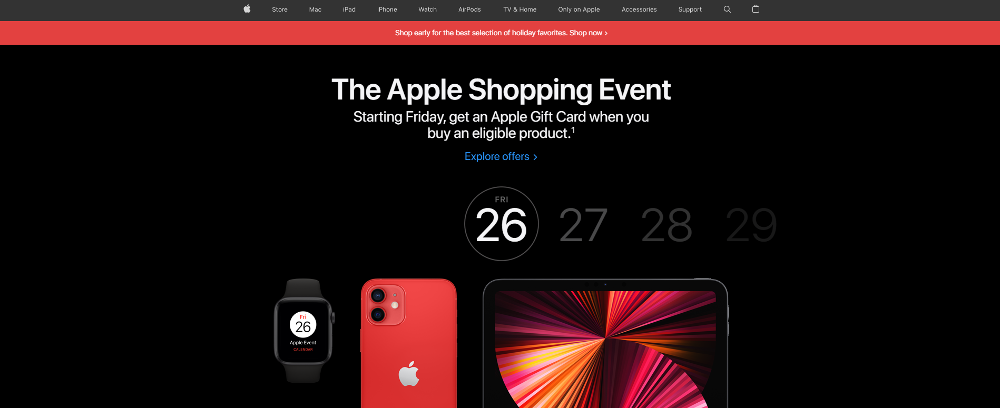

Apple is one of the most successful company in the world and their website reflects that. We can learn a lot by analizing how the webpage is structured.

As with their products, Apple opts for simplicity for their page by implimenting big block designs with large images with muted backgrounds that instantly come into your view when you visit the webpage.

Let's find out how we can build a webpage like this.

## Page Structure
Duration: 5

As with most webpages, this page consists of 3 main components:

-   **Header**: Navigation bar and banner
-   **Content**: blocks (or cards) of products
-   **Footer**: links to various pages

Let's take a look at the page as a whole:

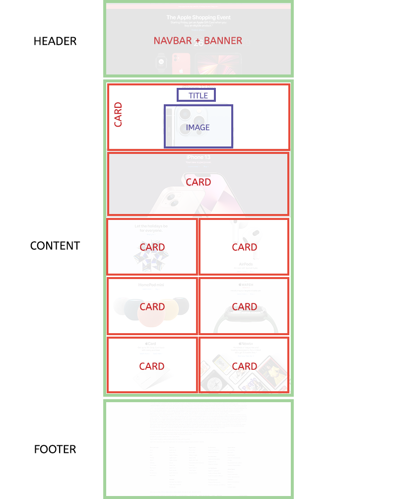

Each of these components can be divided further, and we will talk about them in details in the coming steps.

## Responsiveness
Duration: 17

### Desktop vs. Mobile
The majority of users will visit your website via their mobile devices. Even if your website is perfect for desktop usage, you will lose out a lot of your audience if your mobile version doesn't work correctly (or exist at all). The reason this block design is so popular is partly due to the fact that it is very easy to convert the desktop version of a page to a mobile version.

Notice how when the screen width is small enough, the layout shifts from `1-1-1-2-2-2-1` layout to all single column layout.


This is all made possible because with block design, we can easily rearrange the order of the blocks without destroying the layout using flexbox.

### Side Margin to Ease into Mobile Version

All the blocks on this page have their content in the center while reserving the space on the sides (as margin). As the screen gets smaller, more of this space is discarded through a combination of either:
- `overflow: hidden` for the container and image centered with `transform`, or as a background image with `background-position: center`. In this case, the part of the image that goes outside of the container will be hidden.
- `text-align: center` which will center both the texts and the images, or element centered with `flex` or `transform`.

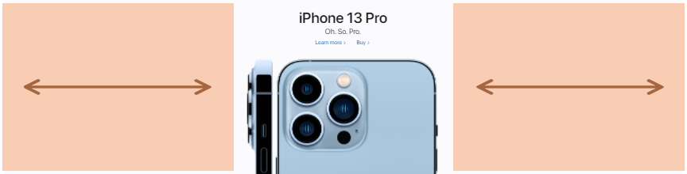

In this particular case, Apple just uses super wide images where the margin is added to the images already, but we can apply this idea to properly cropped product images as well.

In short, you can have **extra space on the sides** which you can safely discard as needed to easily transform your page/block into the mobile version. This is also easier on the eyes for some content as desktop screens are large and if your content spans from edge to edge, it will be tiring for users to have to turn their necks to read. Usually a `max-width` to limit a page from becoming too wide, and that's the (basic) concept of a `container` for frameworks like Bootstrap and Material UI.

Of course there is more to it than just this when it comes to making a webpage responsive. Once you get more advanced with layout design, you can check out [this video](https://www.youtube.com/watch?v=jUQ2-C5ZNRc) which discuss [container queries](https://developer.mozilla.org/en-US/docs/Web/CSS/CSS_Container_Queries).

## Header
Duration: 25

The header consists of a navigation bar, an announcement bar and a banner image (with text).


### Navbar

The navigation bar follows your screen as you scroll. We've learned that it's possible to do this with `position: fixed`.

This is a fixed navbar (fixed with a `z-index` of `9999`). And the way `z-index` works is that it puts the element of a different layer coresponding to the `z-index` value. So the navbar is actually on an entirely different layer than the rest of the page.

Using Chrome layer tool, we can see the layers in 3D:

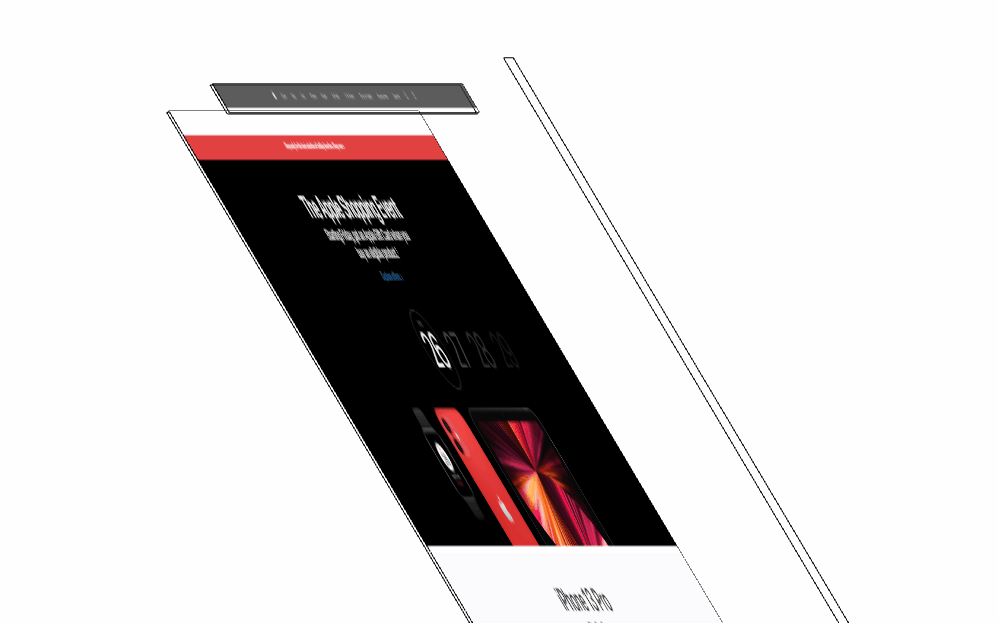

There is a reason why there is a bit of an empty space before the announcement bar. This empty space is for the navbar to hover over when the page first loads, otherwise the navbar would cover the announcement bar.

Note: The long vertical bar on the right is the scrollbar which is on top of everything.

We can use the Developer Tools (Ctrl + Shift + C or Command + Shift + C) to inspect this page and see more details. Let's try and select any image in the header area. You may notice that it's not possible to select any images. The reason is that there's a layer with the class `unit-link` on top of the image layer.

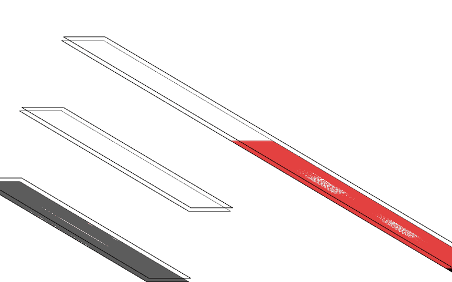

Instead, you can just select the element that covers the images, the element will be highlighted on the `Elements` tab, from there you can explore and find the images which should be just underneath the `unit-link` anchor tag, inside the div with the classes `lockup ase-anim`.

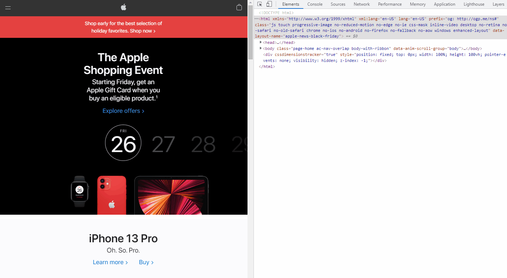

Now you know how to select difficult-to-select or hidden elements. You can also see the style details of the images on the same panel.

### Announcement Bar

The announcement bar is a very simple div with an eye-catching background color. It is very common with e-commerce websites. It is used to notify the users of important, time-sensitive news, like what event or promotion is going on. Example:


### Banner

The banner is simple:
- Title and links/buttons that are centered on the top side.
- The background image is a group of products, positioning at the bottom and is centered.

This style is also applied to the rest of the cards in the page (with the AirPods card being slightly different).

## Content
Duration: 15

The content on this webpage is actually just a repeat of the header. The only difference is that further below, it changes into 2 columns.

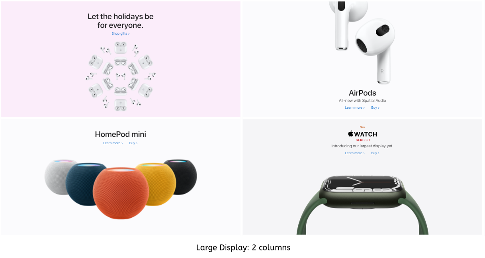

Above: The image/card sides can still be trimmed.

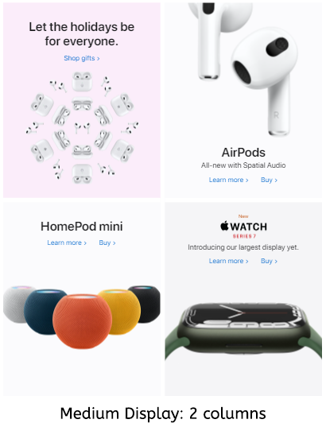

The sides have been trimmed as much as possible. The cards cannot be trimmed any further (or the product images will be cut off). The 2-column layout will switch to single-column:

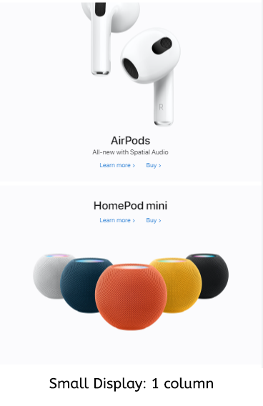

There are several things that happen here:
- When the cards get squeezed to a certain width, the images are switched to smaller versions (we will ignore this for now).
- When even those small images can't fit in the cards, the layout shifts to single column to allow each card more width.

If you use the inspector tool, you will see that when the width is less than 735px, the number of columns becomes 1. This is due to [media queries](https://developer.mozilla.org/en-US/docs/Web/CSS/Media_Queries/Using_media_queries) (queries that target specific media features like `max-width`) this CSS entry:

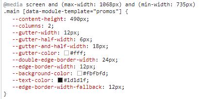

Notice the `min-width: 735px`? This style only applies if the screen width is 735px or more. So when the screen is smaller than that, this style will be ignored and the next applicable one is applied:

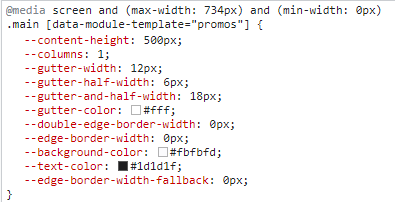

-> You can use this format to apply styles to specific viewport sizes:

```css
@media screen and (condition) {
    .your-style {
        /* something here  */
    }
}
```

## Footer
Duration: 5

We can ignore the footnotes and focus on the real footer. The footer here is simply just texts in multiple columns, and again, with the usual margin on the two sides.

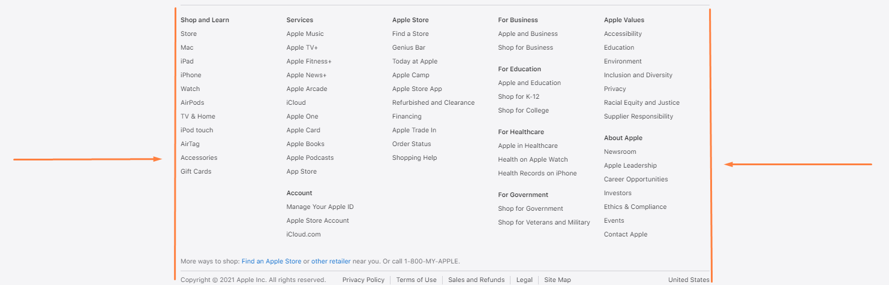

Once there isn't enough width space to display all the columns, the page will switch to the mobile version. In the mobile version, there will be only one column. This can be achieved with flexbox. Texts are neatly grouped as [accordions](https://www.w3schools.com/howto/howto_js_accordion.asp) (which will require JavaScript work).

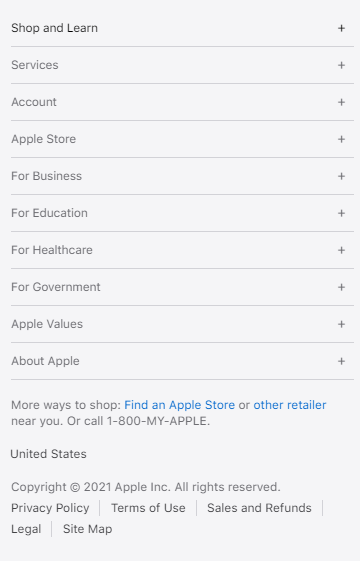

## Conclusion
Duration: 3

By thinking in blocks, we can open ourselves up to more possibilities and flexibility with our web design. Block design helps us develop websites faster, cleaner, and allows us to streamline the development process of both the desktop version and the mobile version. Why "mobile first" when we can design for both at the same time?

Mobile screen sizes are getting larger, and desktop monitors are also getting larger. With a flexible and responsive design, our websites are ready to deal with all the different sizes there are in the world.

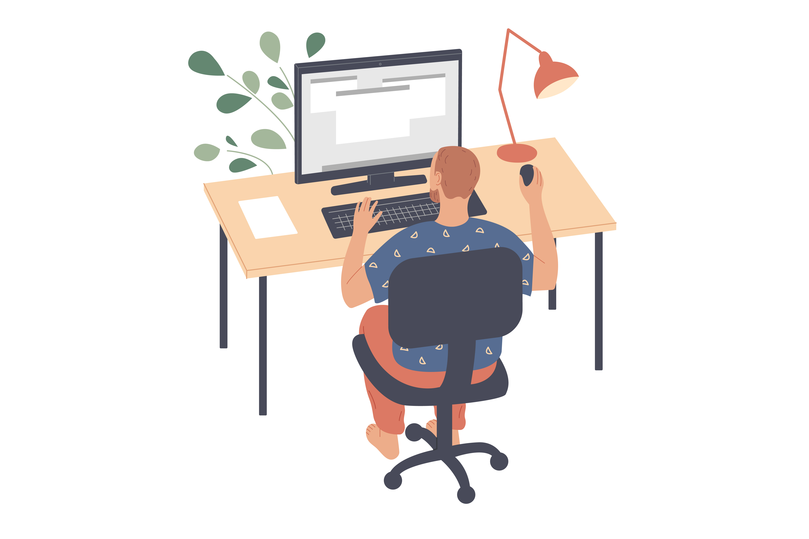