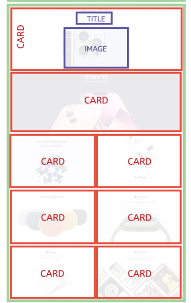

summary: Project Lab
id: wv-m11-project-lab
categories: web-development
tags: web-development
status: Published
authors: Vinh Duong
Feedback Link: https://www.coderschool.vn

# Project Lab

## Instructions

- Log in to [CodeSandbox](https://codesandbox.io/)
- Open this [link](https://codesandbox.io/s/apple-clone-h4qeo?file=/index.html)
- Work on the project (remember to save periodically)
- Submit the link

## Navbar

First let's create the navbar.

- Inspect the navbar on Apple homepage and see its height and background color.
- Set our navbar to the same height, color and background color as on Apple homepage.
- Add the links as `&#60;a&#62;` (but you don't have to link to actual pages, you can use `href="#"`).
- Center the texts.

Hint: You can target all the child `&#60;a&#62;` of `&#60;nav&#62;` like this:

```css
nav > a {
/* your styles here */
}
```

The end result should look similar to this:


## Header

The header section has a black background color, but before we can set and see it, this section needs a height or content inside. The header and the first 2 cards actually have a fixed height of 736px.

- Set the height of the header to 736px.
- Add the texts
- Add the images (`2.png`, `4.png`, `6.png`)
- Center them horizontally and spread them till they touch the edges vertically.

## Main

We can divide the main area into 7 sections, each one is a card.



For each card, you can set a fixed height (use the inpector to see how much you should set it to), then set the background image to one of the provided assets. Then it becomes just like the header we did before.

At first, all your cards would take the full width, so there will be 7 rows for 7 cards. However, on the Apple page, we see that only the first 2 cards take a full row each. The rest of the rows have 2 cards each.

The trick is to use `flex` with `flex-direction: column` on the `&#60;main&#62;` or the wrapper of all these cards and for the child cards, we set `flex-basis` accordingly: `100%` (as it takes 100% of the width) for the first 2 cards, and `50%` (as it takes 50% of the full width) for the rest (change the height of these cards too, use the inspector to see the exact number). Of course we need to set the wrapper to wrap the elements when there's not enough space with `flex-wrap`.

## Footer

You can use flexbox to easily set up the columns in the footer.

That's it! Submit your link when you're done at the next step.