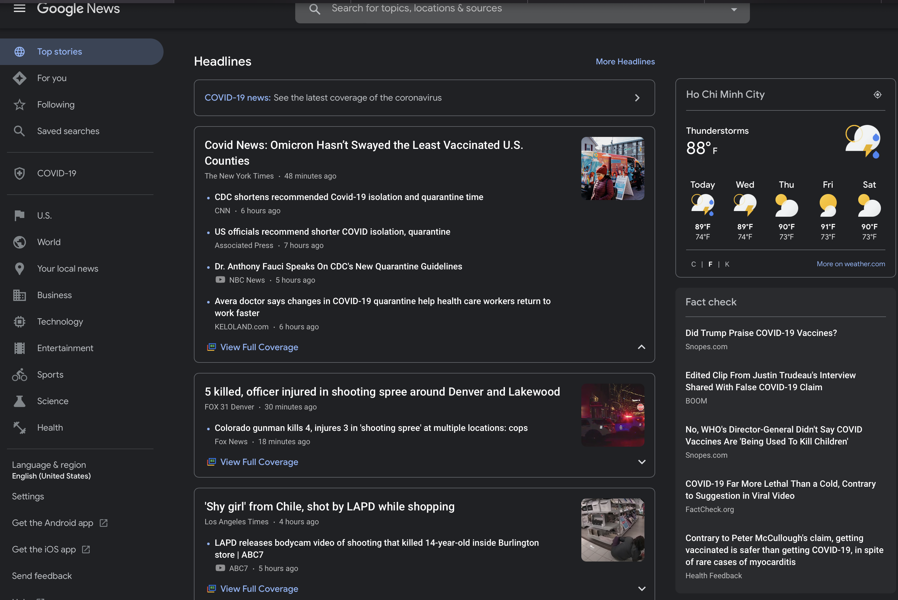
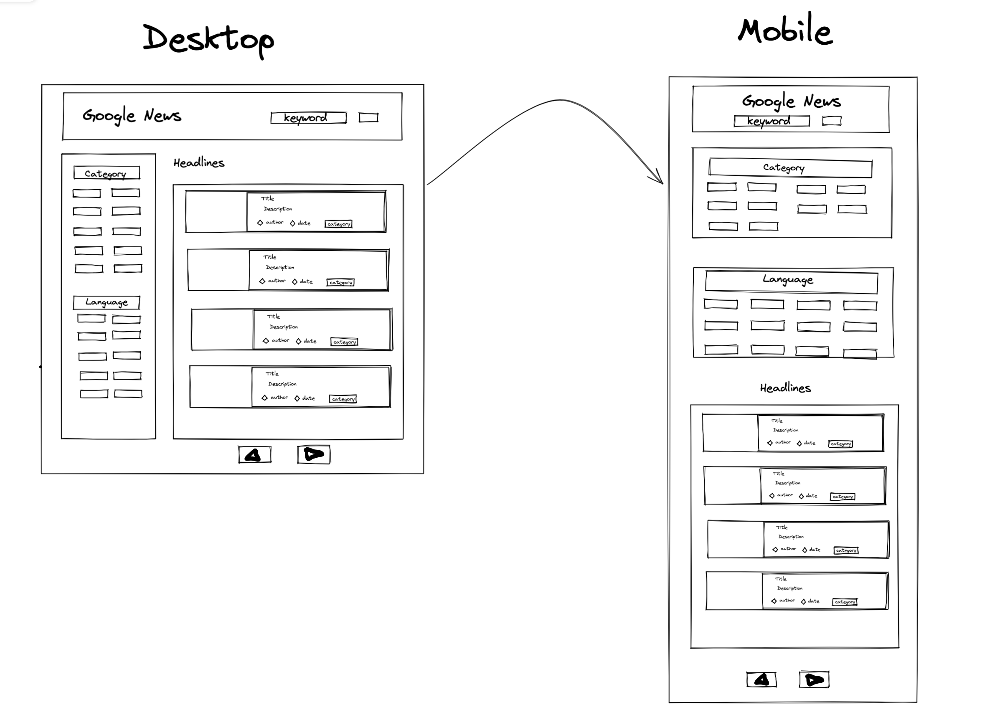
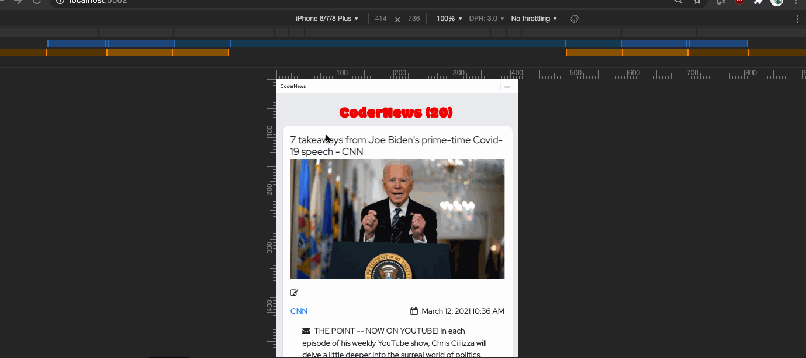

summary: Create Google News
id: wv-m13-google-news
categories: web-development
tags: web-development
status: Draft
authors: Tuan Hoang
Feedback Link: https://www.coderschool.vn

# Google News 📰

## Intro

Duration: 5

### Overview

Newspaper is one of the most popular and required assets of our daily lives. And, in today’s hectic world, reading a newspaper has become one of the traditional ways of reading the news. With the news being created every minute and relayed through TV, radio, and the internet, the updated news is already old by the next morning. And, that’s why newspaper and magazine publishers are struggling to keep up with the pace. Change is needed and publishers must embrace digital news.

So, magazine and newspaper lovers are moving towards reading news on a work desktop and the go mobiles. The revenue model of the news online services is quite simple and rewarding. They run ads and generate a good amount of money.

_Cited at [Appinventiv](https://appinventiv.com/blog/news-app-development-for-android-ios/) - 2020_

## Demos

Duration: 20

### UI design

Our inspiration for this website is from [Google News](https://news.google.com/topstories?hl=en-US&gl=US&ceid=US:en), however, you could choose to either make an exact clone of it or freestyle as you like. (🚀 it is more challenging to create an EXACT clone).

#### Google News original

- [Google News's original](https://news.google.com/topstories?hl=en-US&gl=US&ceid=US:en)

#### Backend API

It is ridiculous to manually update news content to our website every time a piece of news emerged around the globe. Fortunately, the good people on the internet created many free and up-to-date news API services to help us get the latest news. There is a joke that if you could think of it, there must be an API for it. To practice our front-end skill in building this news application,
We'll use the [News API](https://newsapi.org/) to get data into our web. You are expected to be able to find your way through this api by reading its documentation [Here](https://newsapi.org/docs)

## Simplified version

Duration: 20

### Design tool

Since we could freestyle our way to create the UI for this website as long as all the requirements are meet, here is an example of a simpler version. We use [Excalidraw](https://excalidraw.com), an easy to use mockup tool, to sketch out the initial UI design.

- [Link to the mockup ](https://excalidraw.com/#json=tXGsNq27qcYhBXiEyaxH7,Neacv7TN0aWqiXHugbBMAQ)

### The actual website

[Simplified UI Website](###image###)

## Requirements

Duration: 20

### User Story

As a developer, you will get familiar with the term "User story" at the beginning of any project. It describes what the user will be able to do/see with the application.

- [ ] As a user I can see a list of the 20 latest top news stories, loaded dynamically via API.
- [ ] As a user I can see a headline (title), image, writer, source, date, and body of **each article**
- [ ] As a user I can see the total number of stories currently shown.
- [ ] As a user I can see all the categories available.
- [ ] As a user I can see click on a category and see **only** stories in that category.
- [ ] As a user I can see all the languages available.
- [ ] As a user I can see click on a language and see **only** stories in that language.
- [ ] As a user I can click a link at the bottom of the page to load the next 20 stories.
      _optional: The page should not refresh; the stories should add to the bottom of the page._
- [ ] As a user I can search for articles that **match** my queries using a search bar.
- [ ] As a user I can see how long ago the story was published in a human-friendly format; e.g. "15 minutes ago". To accomplish this, we recommend you use [momentjs](http://momentjs.com/). Load it into your page using cdnjs or jsdelivr (these are called [CDNs](https://www.cloudflare.com/learning/cdn/what-is-a-cdn/))
- [ ] As a user, I can easily read articles on the page when viewing from my mobile device. Meaning this website should be responsive for desktop and mobile (iPhone X). For example:
      
- 🚀 Rocket challenge: The search and category filter could combine. Eg. search Elon Musk and categories Business will only show relevant results for BOTH conditions

[The actual fully functioning website ](#netlify)

## Outcomes and grading

Duration: 10

### What you 'll practice

This project challenge is designed to test your understanding on :

- Asynchronous javascript by requesting data from API with Fetch.
- JS on dom by accessing, creating, and editing HTML element
- JS basic syntax and fundamentals
- Basic HTML & CSS with appropriate tags and attributes; selectors and properties

### How we grade your project

You will start the assignment with 100% and will be deducted upon missing any feature.
Our passing grade for this assignment is 80%.

| **Grade** | **Description**                                       |
| --------- | ----------------------------------------------------- |
| - 5%      | Missing rocket                                        |
| - 5%      | Clustered UI                                          |
| - 10%     | Missing responsive                                    |
| - 20%     | Missing any of other user stories that are not rocket |

_Don't worry if you fail this assignment at first , second or n tries, as we allow unlimited attempts._

## Outro

Duration: 5

#### Good luck have fun coding!

