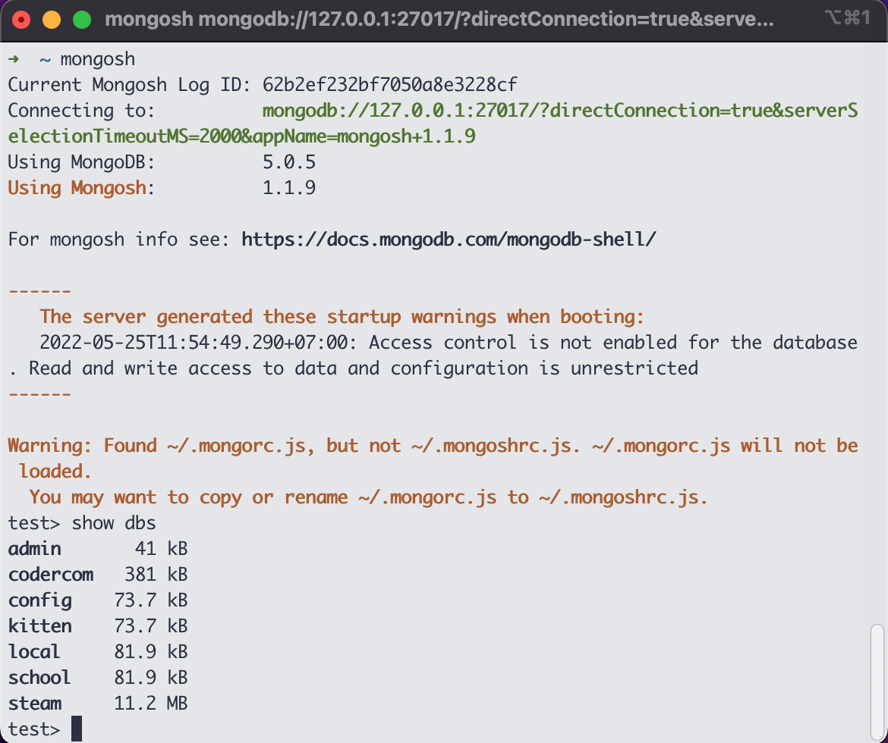

summary: mock data with node js
id: wv-m32-dbsm-mongo
categories: web-development
tags: web-development
status: Published
authors: Tuan Hoang
Feedback Link: https://www.coderschool.vn

# Database Management System

## Definition of Database

"In computing, a database is an organized collection of data stored and accessed electronically from a computer system. Where databases are more complex they are often developed using formal design and modeling techniques.

### Database management system (DBMS)

The database management system (DBMS) is the software that interacts with end users, applications, and the database itself to capture and analyze the data. The DBMS software additionally encompasses the core facilities provided to administer the database. The sum total of the database, the DBMS and the associated applications can be referred to as a "database system". Often the term "database" is also used to loosely refer to any of the DBMS, the atabase system or an application associated with the database.

Computer scientists may classify database-management systems according to the database models that they support. Relational databases became dominant in the 1980s. These model data as rows and columns in a series of tables, and the vast majority use SQL for writing and querying data. In the 2000s, non-relational databases became popular, referred to as NoSQL because they use different query languages." \_[wikipedia](https://en.wikipedia.org/wiki/Database)

Both a database and its DBMS conform to the principles of a particular database model. "Database system" refers collectively to the database model, database management system, and database.

### SQL vs NoSQL

One of the reasons we choose NoSQL is it learning curve beginner friendly. Also as building our first projects we might not know what the end result will look like, what are all the requirements. Therefor, using a nosql database approach is easier to start with.
However, eventually, it is recommended that , as a developer, we should have basic knowledge on both systems. So for those who have FOMO (Fear-Of-Missing-Out), feel free to study both.

### Comparision of NoSQL and SQL

| System | Pros                                                                                                                                      | Cons                                                                                          |
| ------ | ----------------------------------------------------------------------------------------------------------------------------------------- | --------------------------------------------------------------------------------------------- |
| SQL    | Flexible queries, Reduced data storage footprint, Strong and well-understood data integrity semantics                                     | Rigid data models, Limited horizontal, Single point of failure scalability                    |
| NoSQL  | Scalable and highly available, Flexible data models, Dynamic schema for unstructured data, High performance, High-level data abstractions | Distributed systems have distributed systems problems, Lack of flexibility in access patterns |

[Read more](https://www.ibm.com/cloud/blog/sql-vs-nosql)

In bigger applications, you may find that both system could be in apply at the same time for the database.

## What Is MongoDB?


MongoDB is a document database with the scalability and flexibility that you want with the querying and indexing that you need.
As a DataBaseManagementSystem software, MongoDB provide various functions that allow management of a database and its data which can be classified into four main functional groups:

| Function        | Definition                                                                                                                                                                                                                                                                                 |
| --------------- | ------------------------------------------------------------------------------------------------------------------------------------------------------------------------------------------------------------------------------------------------------------------------------------------ |
| Data definition | **Creation**, **modification** and **removal** of definitions that define the _organization of the data_.                                                                                                                                                                                  |
| Update          | **Insertion**, **modification**, and **deletion** of the _actual data_.                                                                                                                                                                                                                    |
| Retrieval       | Providing information in a form directly usable or for further processing by other applications. The retrieved data may be made available in a form basically the same as it is stored in the database or in a new form obtained by altering or combining existing data from the database. |
| Administration  | **Registering** and **monitoring** users, enforcing **data security**, monitoring **performance**, maintaining data **integrity**, dealing with **concurrency control**, and **recovering information** that has been corrupted by some event such as an unexpected system failure         |

## Installing MongoDB

MongoDB update very frequently so does your machine's operating system. Therefore , the quick start guide below could be out of date.

While we try to keep up with these updates, feel free to check out this [Mongo DB official document](https://docs.mongodb.com/guides/) for a detail and up to date guide.

### Quick start for Mac M1

_as at November 2021_

#### Install

```terminal
/bin/bash -c "$(curl -fsSL https://raw.githubusercontent.com/Homebrew/install/HEAD/install.sh)"

brew update
brew upgrade

brew tap mongodb/brew
brew install mongodb-community@4.4

echo 'export PATH="/usr/local/opt/mongodb-community@4.4/bin:$PATH"' >> ~/.zshrc

sudo mkdir -p /System/Volumes/Data/data/db


alias -g mongod="sudo mongod --dbpath /System/Volumes/Data/data/db"

source ~/.zshrc
```

#### To run

```terminal
mongod
```

#### Explanation

Since the new updates, Apple do not allow service like mongod and brew to access to home folder. MongoDB however, need a `/Data/data/db` to contain all data.
So the step were

1. Install Home brew : package manager that help ease the installation for Mac and Linux
2. Search for new `update` then `upgrade` home brew
3. Connect to the `mongodb/brew` tap on github
4. Install the community edition of mongod via brew . Current version is (mongo-community@4.4)
5. Create a congfig ~/.zshrc (or ~/.bashrc but i would recommend install [Oh my zsh](https://ohmyz.sh) to use zsh), then export the Path to mongo executed files to `Machine's root` so that we could use the `mongo services` with CLI everywhere.
6. Super User access to create `Data/data/db` at `System/Volumes`
7. Super User to **Ch**ange **Own**ership to the foler we just created. Why? Because without the ownership we can not **Write** to the folder
8. To run `mongodb` we must specify which folder to use as the `db` folder . Which is the one we just created.Hence `mongod --dbpath /System/Volumes/Data/data/db`.
9. But `mongod --dbpath /System/Volumes/Data/data/db` is long and we kinda have to type it everytime we want to run mongodb. so we use Super User access to create an shorter version , hence `alias sudo mongod --dbpath /System/Volumes/Data/data/db`
10. Save and execute sourcing zsh config.

### Installing Mongo DB for Windows

There are many version of Windows among learners.[Mongo DB official document](https://docs.mongodb.com/guides/) did a really great job accounted for these differences. Please refer to the guide with your appropriate Windows versions.

### Install success

You should be able to use the mongo shell `mongosh` on your terminal and see all your current local database.
For examples



Feel free to ask a question in our community if you experience any issue.

## Mongo compass

Todos:
Install
Connect
Test get
Test create
Test edit
Test delete

## The end

Great job finishing this lab!

If you want to read more about this topic here are some cool materials to expand your knowledge

### Further resources

- A good to have certificate for better understanding of Mongo Ecosystem [M001 Mongo Certificate](https://university.mongodb.com/courses/M001/about)
- Read more on the debate [SQL vs noSQL](https://www.guru99.com/sql-vs-nosql.html)
- Fear of missing out ? [Add SQL to your arsenal](https://www.froglogic.com/blog/)
- Download and install MongoDB Community Edition ([Windows](https://docs.mongodb.com/manual/tutorial/install-mongodb-on-windows/))
- Download and install MongoDB Community Edition([Mac](https://docs.mongodb.com/manual/tutorial/install-mongodb-on-os-x/))
- Grab this free and easy certificate from MongoDB _(optional)_ [M001 course](https://university.mongodb.com/courses/M001/about)

### Good luck have fun !
