summary: mock data with node js
id: wv-m32-mongo-atlas
categories: web-development
tags: web-development
status: Published
authors: Tuan Hoang, Tan Vo
Feedback Link: https://www.coderschool.vn

# Database on the cloud

## Host your database with Atlas

Todos:

- why host data
- what is atlas
- what is benefit
- what we learn
  - how to create account
  - how to authenticate
  - how to connect with compass and node project
  - how to import/export data (migration)
- what are alternatives (firebase, amazon, ... )

## Get started with MongoDB Atlas

- Select Create an Organization

- Name your Organization `MDBU`. Make sure that your cloud service is _Atlas_, then hit Next.

- Hit Create Organization

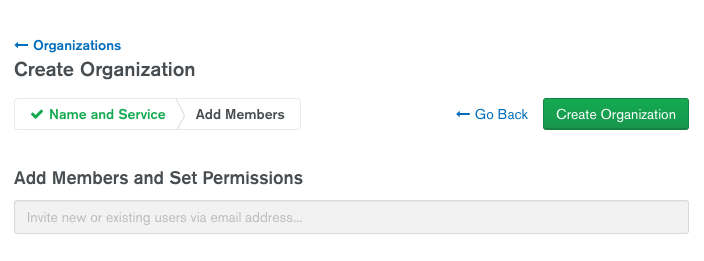

- Hit New Project

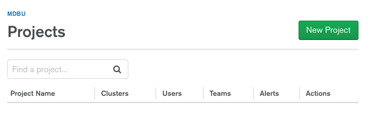

- Name your Project `M001` and hit Next

- Select Create Project

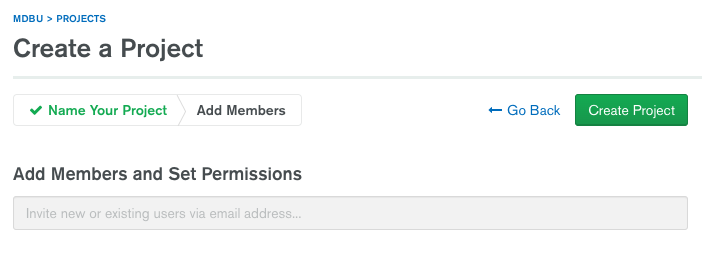

- Select Build a Cluster

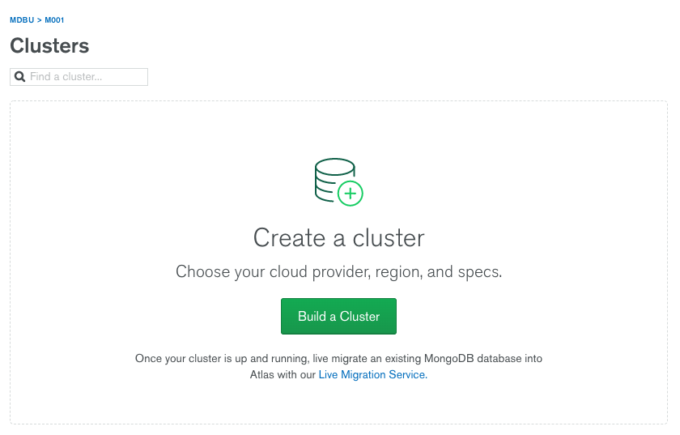

- Select the left-most option that is FREE and hit Create a cluster

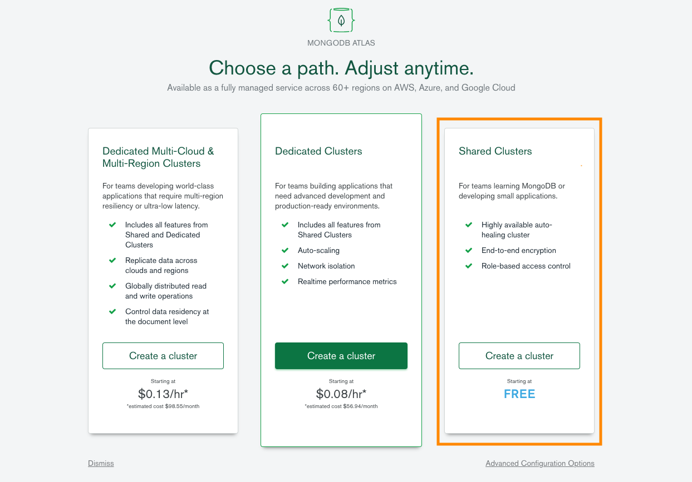

- Select the region that is geographically closest to your location. On the bottom of the page change the cluster name to `Sandbox`. Create the cluster. _This step might take a minute or two to complete._

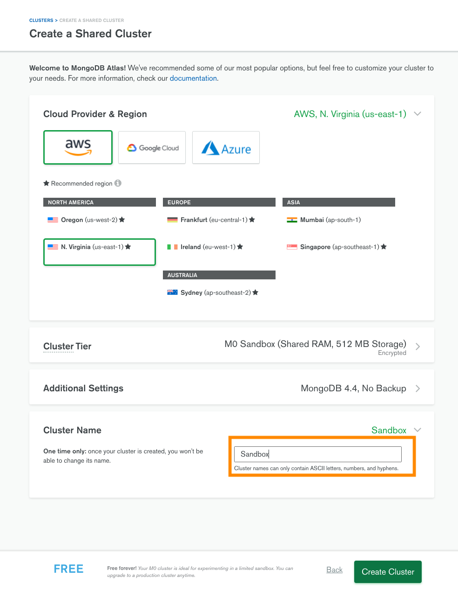

- Now that you have an Atlas cluster you need to grant access to your IP Address and create a Database User.
  - Select Connect from the cluster view.
    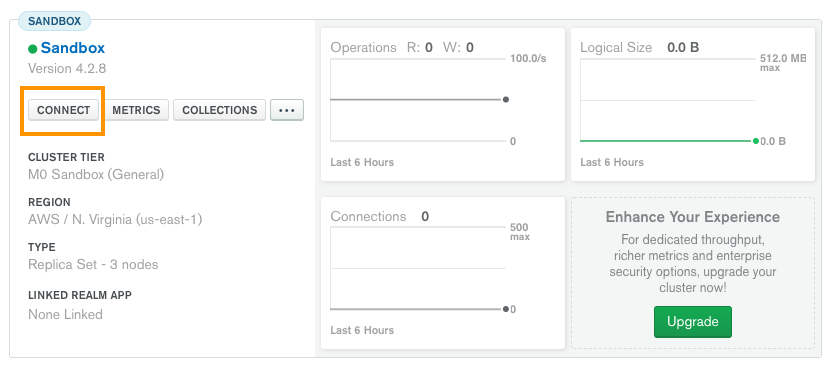
  - Select the _right-most_ option Allow Access from Anywhere and confirm your selection by clicking on Add IP Address. Allowing access from anywhere is not\* a good security practice. Clusters that are used for production should \*\*not have this enabled.
    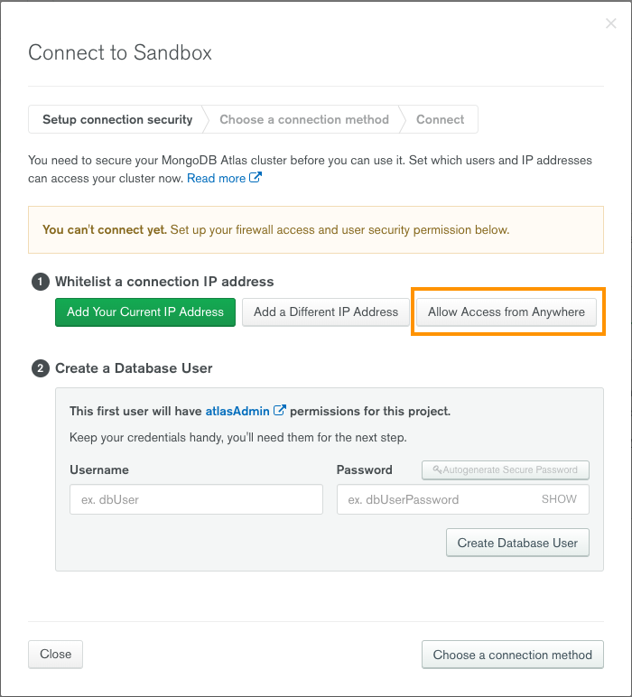
  - Create a Database User, then click on Create Database User
    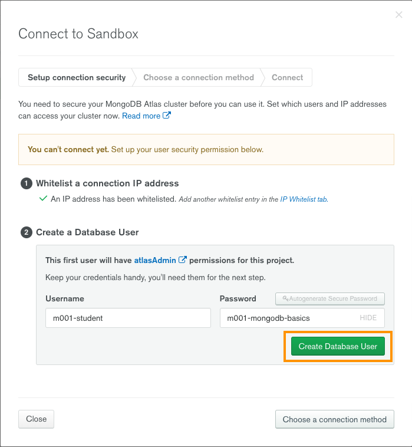
  - Close the Connection menu at the _lower left corner_ of the window.
    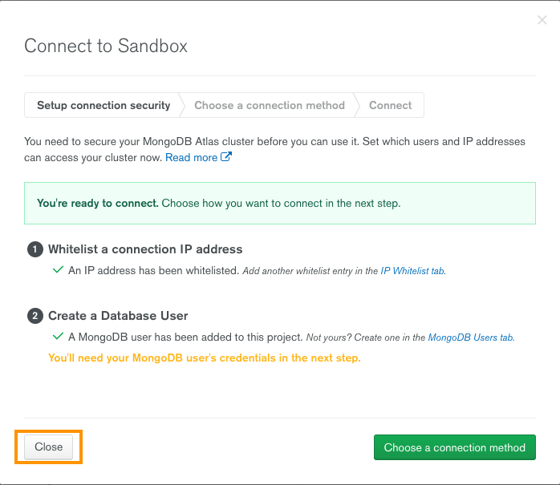

**Load the [Sample Dataset](https://docs.atlas.mongodb.com/sample-data/sample-training)** (for practicing)

Select the "..." option in the cluster menu -> choose the "Load Sample Dataset" option, then confirm your choice.

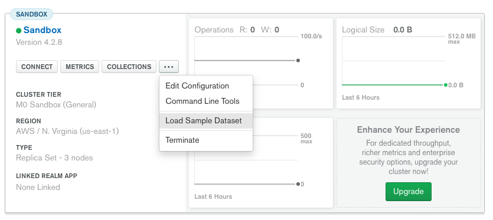 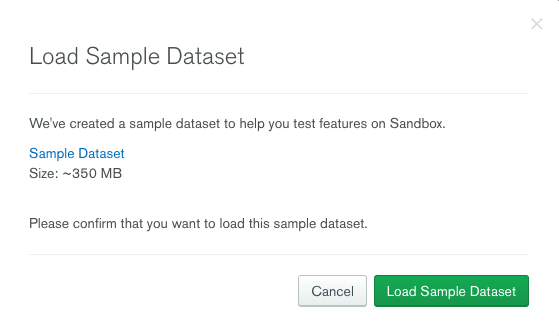

When the dataset is loaded the graph labeled "Logical Size" on the right side of the screen should go up and display the size of the dataset that is above zero and below _512 MB_. Your graph may look different than the picture below.

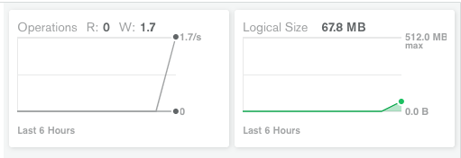
{"mode":"full","isActive":false}

## The end

Great job finishing this lab!

If you want to read more about this topic here are some cool materials to expand your knowledge

### Further resources

todos
