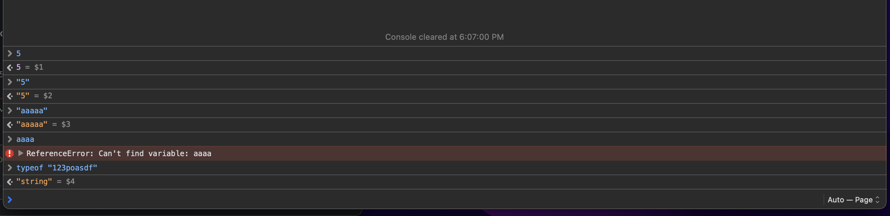
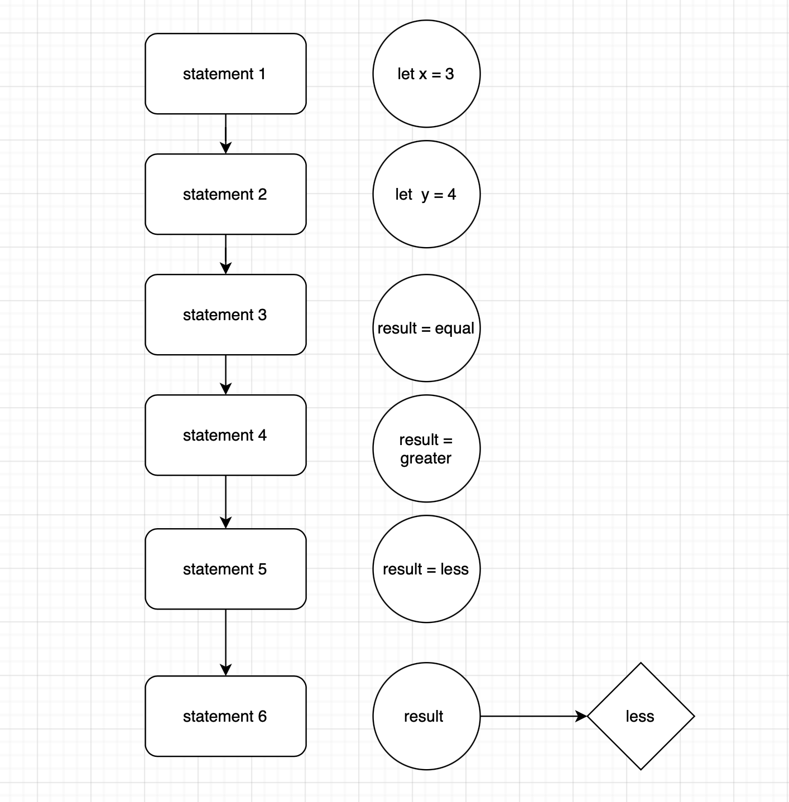
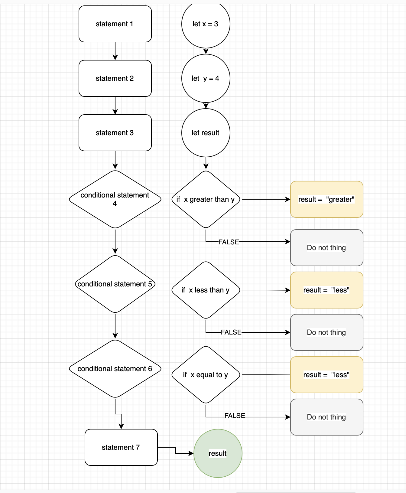
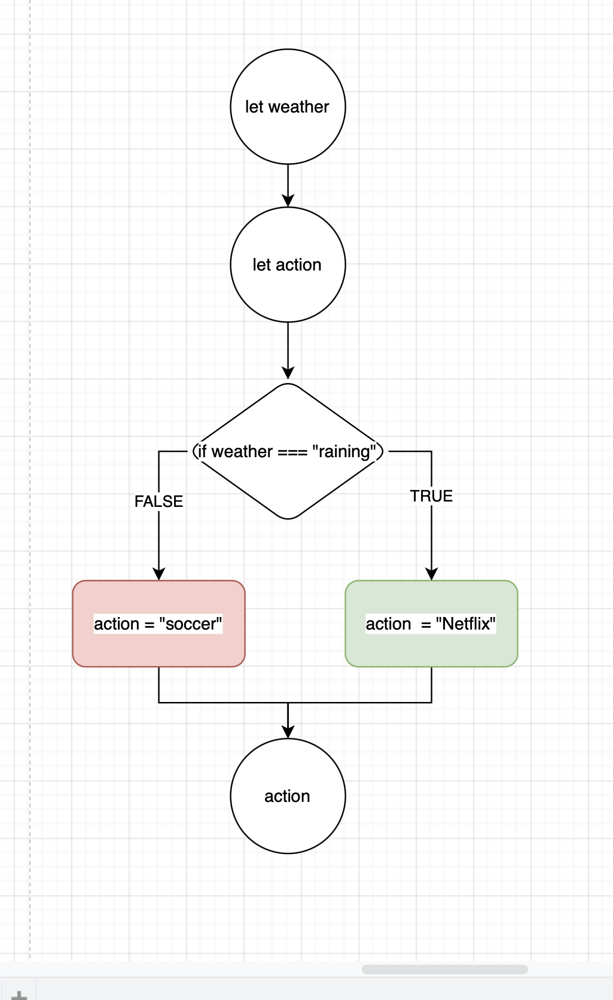
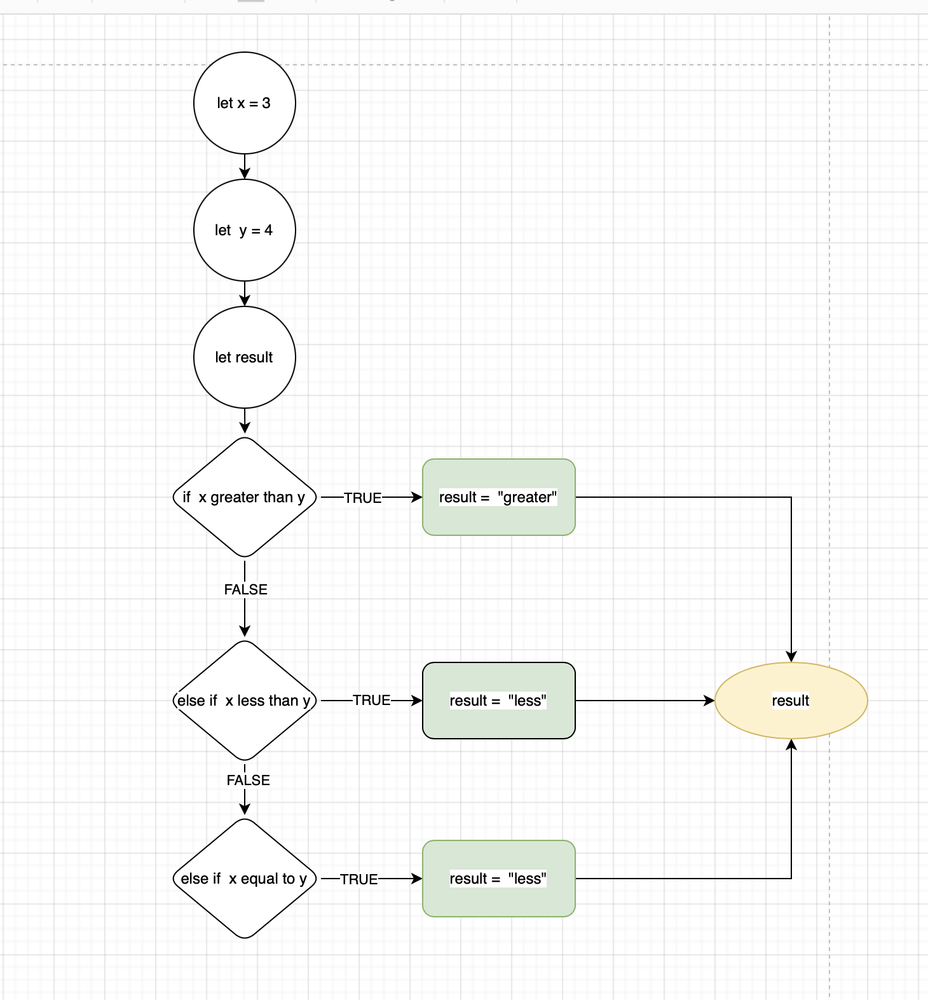
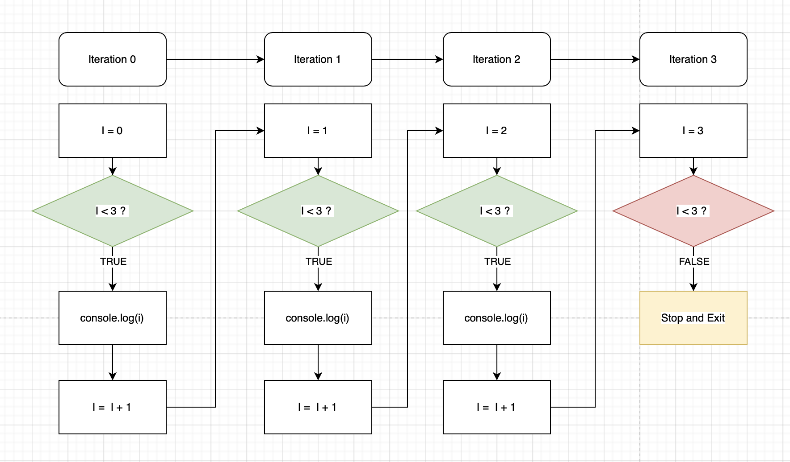

summary: Introduction to Programming
id: intro-to-programming
categories: web-development
tags: web-development
status: Published
authors: Tuan Hoang
Feedback Link: https://www.coderschool.vn


# Introduction to Programming

## What is Programming?

There are many definitions about programming, mine is: 
**" Programming is us teaching problem-solving skills to the computer to utilize its computation power and work on our problems. In the meantime, we could be lazy "**

There are four important keys in that definition :
- **Us**: we *programmer* responsible for teaching the computer. Without us, the machine has no use. Except if you want to use it as a paperweight.
- **The computer**: is a complex but dumb tool, it needs clear instructions to do things. 
- **Solve problem**: world problem could be solved by programs
 - "1024 * 13 =?" : introducing **calculator**
 - "A paperless map that recommends the best route according to real-time traffic status": introducing **Google Map**
 - "Human want connection": introducing **Yahoo, Facebook**
 - "Unlimited and curated TV channels for only me": introducing **Youtube**
 *This is why software is often called solutions as they offer the answer to our demand.*
- **Be lazy**: Being 24/7 telling our computer what to do makes us look like a hard-to-pleased boss. We want our computer to be able to see the pattern in a variety of issues and consistently follow our instructions to solve them. 

For example, imagine a Youtube developer who manually adds video to the platform every time someone around the globe adds their cat's moment. Then imagine another Youtube developer, teach the computer to see every cat/dog/human video as, well, simply a video. So every time someone adds a video, that video will be uploaded. Who earns more? You guess it right, the latter dev earns more than $100,000 a year while the other one does not exist. 

In web development, the role programming (JavaScript) is illustrated below


## Programming languages


In the early days of programming, there were no programming languages. A computer uses Binary as their communication means by using the value of `1 and 0`. So at the low level, to print out a "hello worlds" text to this website you are reading, the code may be like this:


Scary isn't it? But programming has been evolving to break down this language barrier, making programming easier to learn and more efficient to work. C#, Python, JavaScript and Java, are High-level programming languages. Each of them has 1 common purpose which is to translate more human-friendly languages into those machine languages that machines understand. Think of them as English in a conversation between multi-national members in a group.


Every programming language while having differences in syntax, structure, and rules, is sharing the same computer science concepts.
There are a few basic concepts you need to remember. They act like building blocks. To build a tall tower, you start first by putting a block on top of the block. Here are some of the essential programming building blocks:

- **Variables** to store data (aka state) during your program’s execution
- **Declare**: Creating a new variable (distinct from the assignment)
- **Operators**: Symbols that are used to assign, compare, and perform operations
- **Assignment**: Assigning a value to a variable
- **Data, Data Type**: Kind of data, defined by the values it can hold and the operations that can be done on it
- **Statement**: A single piece of code that accomplishes one task or action
- **Expression**: A statement that produces a value
- **Conditionals**: like if statements to make decisions
- **Loops** to repeat tasks until a condition stops being true

## Data

### The secret of computer
There is only data on the computer. The computer understands, store and use data that are represented as long sequences of *bits*. 
Here is how computer stores number `13` : ```0 0 0 0 1 1 0 1```
Look at this Binary values table:
```
value : 128 64 32 16 8 4 2 1
binary: 0 0 0 0 1 1 0 1
```
This is a way computer store a :
- number that is not equal to zero
- and not contain 128 and 64 and 32 and 16 and 2
- but contain `8` `4` and `1`
-> the number is `13`

### Values and data types
These are some values :
```js
"abc" "as" "d" "c"
123 345 15 5 
"abc123"
```

In programming, we group different values into `types`, often called `data types`.
Different languages will have more or fewer types but in general, these types are :

- number : any mathematical number value (7,0, 0.411, -3). To make a number simply input that number from your keyboard

- string: text value such as one alphabetical letter or a group of them, space, line break, or even a representative of number. like "13" is not a number but a string. To make a string we will wrap any content in a pair of quotation marks" ` or `''`. 

- boolean: a boolean will result in either `true` or `false`. To make a boolean, simply type `true` or `false`.

This course focus on JavaScript, so here is the list of the remaining data types that we will learn `Null, undefined, symbol, BigInt, Object`. 

For the following section, we will use `typeof`, a JS operator that helps us identify the data type of a given value. 
The structure

```js
// typeof <anyValue>
typeof 3
typeof true
typeof "true"
```

### Practice exercise

To get your hands on these concepts, try to use some value on your browser console.

- Try to make the console echoing (return) a number you like
- Try to make the console echoing (return) this string "I am a string"
- Try input this without quotation `I am not a string`
 - Error, why? Because without `" "` the console do not understand what you are trying to do.
- Try to make the console echoing (return) a boolean 
- Try to make the console echoing (return) a string `"true"`
- Try to make the console echoing (return) the type of `3`
- Try to make the console echoing (return) the type of `"3"`
- Try to make the console echoing (return) the type of `false`
- Try to make the console echoing (return) the type of `I am error`

Example output 


## Variable
The simplest explanation for the variable is that they are name tags we bind to values. 
By binding value and name together, we can store and access data more efficiently. 


For example , in calculating Gravity force of our beloved Earth, we have the value `9.80665`. Given a rocket launch program that use this value many times. (The example below is not a real rocket launch algorithm, please do not attempt to try make your own rocket.)
```js
//vroom vroom
~~ 3.14 + 9.80665
~~~~~ 3.14 + 9.80665 * 34 + 3^2
~~~ 123 / 9.80665 - 56 + 1235 * 9.80665^4-1
~~~~~ 3.14 + 9.80665 * 34 + 3^2
~~ 3.14 + 9.80665
//vroom vroom
```
We could see that repeatedly typing `9.80665` into our code is not only a waste of time but also open us to mistakes and error. So how can variables help?

### Delacre a`variable`


There are 3 things to remember when it comes to the variable:
- declaration: define what type of variable `let, const` and what is the name. You will also see `var` from old projects, documentation, and tutorials. For now, let's just use `let` and `const`. 
- binding value: assign a value to that variable name using `=`
- calling variable's value: make a call to the machine: "Hey, what is the value of this guy?"

```js
//Declaration 
//Making a variable called x and this variable could be re-bind / re-assign new value
let x 
//Bind
//Assign/ bind the value 5 to x
x = 5 
// Call
// "Hey, return me the value of x"
x 
```
Try this in your browser console to see the output.

```console
let x 
<- undefined
x = 5 
<-5
x 
<-5
```
Every time we hit enter on the console, the browser console will try to return to us some value. So if there is no value to be found you will receive `undefined`
The steps are :
- `let x`: at this point x have not to bind to any value, so hitting enter at this line give us the value is `undefined`
- `x = 5` : x is now assigned with `5`. thus console output is `5`
- `x`: the machine looks for a name tag called `x`, then looks at the bound value, which is `5`. thus output is `5`

Anytime in our program, we could reassign a new value to `x` 
```js
//To save time, we could declare a variable and assign value in 1 statement
//Declare and assign
let x=5
//Reassign with new value
x="A"
//calling
x
``` 

Sometimes, especially in our case with the rocket launch example, the value of our variable is a constant (Gforce, Pi, ...), meaning it should not change. To prevent accidentally changing these values, we will use the keyword `const` when declaring a constant variable. 

```js
const GForce=9.80665
//try reassign it
GForce = 0
//ERROR
```

The new rocket launch program will be :

```js
const Pi = 3.14
const GForce = 9.80665

//vroom vroom
~~ Pi+ GForce
~~~~~ Pi+ GForce * 34 + 3^2
~~~ 123 / GForce - 56 + 1235 * GForce^4-1
~~~~~ Pi+ GForce * 34 + 3^2
~~ Pi+ GForce
//vroom vroom
```

**In short**, variables are name tag bind with value. `let` variables could be reassigned with new value while `const` variables can not be reassigned. To declare a variable and assign value we will use this structure `let varName = value` or `const constant = value`. Using a variable name is like "Hey machine, give/return to me the value of this name", you would receive a value. **Calling a variable name, you will have its value**

### Naming rules and convention

**"The hardest thing in programming is naming thing"**

Imagine on our first day at work as a junior dev and have to work on this :

```js
let x11y340 = 0.1
let m11i = 1000
let y = "$USD"
//return the total interest of deposit 
```
Would it be better if there is some more comment describing what is this variable does? like this :

```js
//This is the interest rate of the bank
let x11y340 = 0.1
//This is the amount of deposit at Nov
let m11i = 1000
//This is the currency 
let y = "$USD"

let interest = x11y340 * m11i + y 
```

And would it be even better if we have this :
```js
let interestRate = 0.1
let novemberIncome = 1000
let currency = "$USD"

let interest = interestRate * novemberIcome + currency
```

From those examples we could see that :
- Variable's name should be self-explanatory, it tells what role that variable plays, maybe type to
- Naming variable is our way to make coding Human-friendly so that it is easy for us and our team easier to understand

In addition :
- Variable name is unique (within its scope) and case sensitive. 

```js
let myVar = 9
let myVar = 8 
//ERROR myVar already declare
let mYvAR = "No error here"
```
We could see that myVar and mYvAR are 2 different variables names so there would be no issue.

- For a variable's name that is made off multiple words like `myVarForYOU`, the best practice (convention) is to use **camelCase** style

```js
let NotUseThis 
let not-use-this
let not.use.this
let not_use.this
let not use this

let beCalmAndJustCamelCase
```
- Lastly, notice that there are words that have been taken for other purposes, so just be mindful and not use them
because `let let = 1` would make no sense right? 
Here is the [list of registered keywords](https://www.w3schools.com/js/js_reserved.asp) 

## Operator

**Math**: 
To perform math operation :
- `+` (Addition)
- `-` (Subtraction), 
- `*` (Multiplication),
- `/` (Division), 
- `**` (Exponentiation), 
- `%` (Modulus or Remainder) : `3%2` return the **remainder** of `3/2`, which is `1`
- `++` (Increment), : increase by 1 
- `--` (Decrement) : increase by 1

**Variable Assignment**

We have seen the `=` operator used for assigning value to a variable. Let take it a step further when an expression's result is the value to assign to a variable

For example , try in your browser console
```js
let a 
let b = 5
a = b * 2
a 
```
- `a` and `b` are called **variables**. Variables hold values to be used by the program.
- `=` and `*` are assignment and mathematic **operators**.
- `b * 2` is an **Expression** that value is the result of `multiply` with `2`. Equal 
- The statement `a = b * 2;` tells the computer to get the `value of b`, `multiply` that value by `2`, then store the result back to the variable `a`. which is `10`
- a is now assigned with value `10`


**Compound assignment**: 
- `+=`, `-=`, `*=`, `/=`: is a short way to reassign a new value to a variable using the result of the previous calculation
For example `a += 2` is the same as `a = a + 2`


**Equality comparision**: 
- `==` (loose-equals), ignore `data type differences` compare 2 `values` an return `true` if they are `equal`, else `false`
- `!=` (loose not-equals) ignore `data type differences` compare 2 `values` an return `true` if they are `not-equal`, else `false`
```js
1 == 1 //true
1 != 1 //false
let x = 1 
let y = 1
x == y // 1 ==1 // true
x != y // 1 !=1 // false

let number = 14
let numberString = "14"

number == numberString // 14 == "14" //true

```
- `===` (strict-equals) and `!==` (strict not-equals) are alternatives if we do also want to compare 'data type'

```js
let number = 14
let numberString = "14"

number == numberString // 14 == "14" // true
number === numberString // number 14 === string "14" // false // number not equal to string

```

**Comparison**: 
We also could compare if values are `greater than` or `equal to`
- `<` (less than), 
- `>` (greater than), 
- `<=` (less than or loose-equals to), 
- `>=` (greater than or loose-equals to)

**Logical**: 
We could connect many expressions by using :
- `&&` (and) : true when both are true
- `||` (or) : true when either one are true

```js
let first = 1 == 1 // true
let second = "a" == "b" //true
first //true
second //true
first && second //true
//because 
1 == 1 && "a" =="b" //true && true // true

```
Another example 

```js
let first = 1 === "1" //false . strict-equal 
let second = true
first && second // false && true => false
first || second // false || true => true
```

## Flow control : Conditional 

### Conditional

Sometimes we want to perform an action based on some kind of condition. In English, we can say “If this thing is true, then do that.” In JavaScript, conditionals are written very similarly and allow us to take a certain path in our program.

Check out this example codes to compare `x vs y` then assign answer to a `result` variable :
```js
let x = 3 ;
let y = 4 ;
let result 
result = "equal";
result = "greater";
result = "less";
result // less
```
The following diagram shows the flow of execution of this script

You could see that by default, your statements will be executed orderly from top to bottom. Your result variable's value will be updated with the lastest assigning, "less". 

Even though there is no error to this, but we are having a logical issue since there could only 1 answer to the question :
- **Is x greater or equal or less than y ?**

This means that we want to control which `result = ` statement to be executed and which to be ignored.
In plain English, the instruction would be :
- declare a variable named x and assign to it a value of number 3
- declare a variable named y and assign to it a value of number 4
- declare a variable named result with no value assigned
- if x > y is true, assign the string "greater" to the result. otherwise do nothing
- if x < y is true, assign the string "less" to the result. otherwise do nothing
- if x == y is true, assign string "equal" to result. otherwise do nothing
- call out the value of the result

### IF statement
To write conditional we will use `If`



The JavaScript code version of this is 

```js
let x = 3
let y = 4
let result
if(x > y){
 result = "greater"
}
if(x < y){
 result = "less"
}
if(x == y){
 result = "equal"
}
result
```
Using `if` give us the control of which statement should computer execute when giving conditions. The structure of an `if` statement is :

```js
if (<an Expression>){
 //everything in here will be executed if the Expression is true
}
```

### If...else statement

We often also use `else` to control what to do when the Expression turns out `false`. For examples :

```js
let weather
let action

if(weather==="raining"){
 action = "Netflix"
} else {
 action = "soccer"
}
action
```



### If...else if statement
Another way to write our conditional logic is using `if...else if`. The reason we choose this structure is to also control some nested conditions when `else` is activated. 



Here is the code 

```js
let x = 3
let y = 4
let result
if(x > y){
 result = "greater"
}else if(x < y){
 result = "less"
}else if(x == y){
 result = "equal"
}
result
```

## Flow control: Loop

### The problem: Don't Repeat Yourself
Let's say we create a program to help `counting` starting from 1.

At its core, the logic will be

```js
console.log("1")
```
The `console.log()` is a function to help us print some value to the console. Print / display some value. Input any value or variable between `(...)` to print it to the console.

How about from 1 to 10 
```js
console.log("1")
console.log("2")
console.log("3")
console.log("4")
console.log("5")
console.log("6")
console.log("7")
console.log("8")
console.log("9")
console.log("10")
```
How about `100`, `1000`, or `10000`?

You could see that the higher our limit is, the closer to impossible to make if we try to write each line of code manually.

### Introducing Loop

A loop is a block of code that helps us to repeatedly run some logic.
There are parts of the loop:

- type or format of a loop: there are many types of a loop but we will only focus on the `for` loop.
- iterator: a variable which value may change from the previous iteration to the current one.
- exit condition: a condition to end the loop and run other logic in our program. Without or having wrong exit conditions, one may be stuck in an **Infinite loop**.

Don't be this guy :


### For loop

Here is a structure of a `for loop`
```js
for (iterator; exitCondition; update) {
 //logic to be loop
}
```
- The type of loop : `for`
- loop setting separated by `;` : `iterator`, `exitCondition` and `update`

For example, this time using for loop to count from 1 to 3

```js
for(let i = 0; i < 3 ;i = i + 1){
 console.log(i)
}
```
What we have done are :
- Create a `for` loop
- Declare a variable `i`, assign value `0`. In computer science, we start counting at `0`. Since this is in a loop so this variable has another name for its role `iterator`
- Set an exit condition that if `i <= 10` still `true`, continue looping. Else when `i`'s value no longer `< 3` eg `i == 3`, stop and exit the loop.
- At the end of every iteration of the loop, assign to the iterator `i` a new value equal to the `current value of i increase by 1`
- In every iteration, the i value is changing 0, 1, 2. Which mean every time we execute the `console.log(i)` we would print out that exact value of `i` in every turn 


## Checkpoint 

By now you should be very familiar with these fundamental programming concepts

- **Variables** to store data (aka state) during your program’s execution
- **Declare**: Creating a new variable (distinct from the assignment)
- **Operators**: Symbols that are used to assign, compare, and perform operations
- **Assignment**: Assigning a value to a variable
- **Data, Data Type**: Kind of data, defined by the values it can hold and the operations that can be done on it
- **Statement**: A single piece of code that accomplishes one task or action
- **Expression**: A statement that produces a value
- **Conditionals**: like if statements to make decisions
- **Loops** to repeat tasks until a condition stops being true


