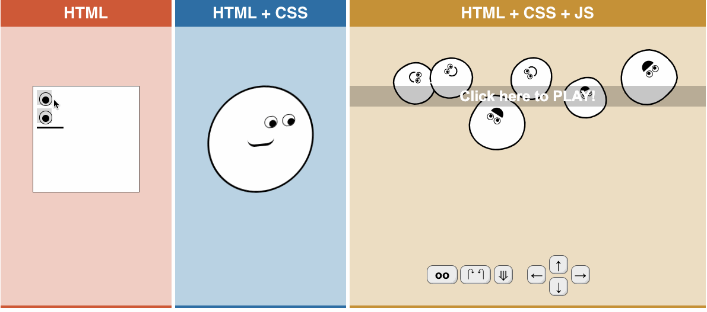

summary: Programming with JavaScript
id: javascript-fundamentals
categories: web-development
tags: ftw-virgil
status: Published
authors: Dat
Feedback Link: https://www.coderschool.vn

# JavaScript fundamentals

"real" programming using Javascript.



### [Demo](https://html-css-js.com/)

[Javascript/ES6](https://developer.mozilla.org/en-US/docs/Web/JavaScript) is
used for building [APIs](https://nodejs.org/en/)
, [mobile apps](https://facebook.github.io/react-native/)
, [webpages](https://www.google.com/search?q=popular+sites+using+react&oq=popular+sites+using+&aqs=chrome.3.69i57j0l5.4978j1j1&sourceid=chrome&ie=UTF-8)
, and
even [desktop applications](https://en.wikipedia.org/wiki/JavaScript#Later_developments)


Technically speaking, this is now "real" programming. HTML/CSS are quite
limited in what you can do. In particular, it's quite difficult to make "
decisions". HTML is just a representation; there's no logic built into it. (
Side note - if you really want to get technical you can read through the
concept of
how [CSS is Turing Complete](https://stackoverflow.com/a/5239256/396324).
Being "Turing Complete" means you can theoretically write any program in this
language.)

There are many programming languages in the world. The "original" language,
that is still widely in use today, is called C. It has
a [fascinating history](<https://en.wikipedia.org/wiki/C_(programming_language)>)
and much of the world you see today runs on C.

Although C is useful, it is quite complex, and not very easy to use with
webpages. JavaScript is the right tool to use for this, and a fascinating
language in its own right.

## Function

### What is a function?

- Think about a washing machine: you put clothes into it, connect the plug into
  an electrical outlet, press some buttons, and wait until it finishes. This
  machine washes the clothes for you. It does a specific task.
- Pretend that there is a machine which has input: rice/grain, and output:
  cake. You put rice/grain into the machine, and you get cake from the output.
- Most of the time, function is similar as machine (most of the time means not
  always), a common function will have inputs (or parameters or arguments/args)
  and have output (that's the value after return, return will be explained more
  detail later).
- We will have a simple function (just have a look first): the `add` function,
  it is similar to a machine. `add` function will take 2 input/args: two
  numbers `a` and `b`, and return `c`, the sum of them.

```js 
function add(a, b) {
  let c = a + b;
  return c
} 
```

- And, in a function, inputs are optional, return value is also optional. The
  shortest function is something like this:

```js
const a = () => {
};
```

We have a function `a` with no input and no return value, but it's still a
function.

- A function inside an object or class is called `method`.

### Why we need functions?

- Functions reduce your workload (imagine that you don't need to wash your
  clothes by hands anymore).
- Functions also increase the re-usability of code. You write your functions
  once, and these functions can be used everywhere in your project (imagine
  that they design a washing machines once, make mass-production, and it helps
  millions of families).

### How to create a function?

#### 1. Function Declaration

Syntax:

```js
function function_name(input) {
  // statements 
  // return
};
```

Example:

```js 
function hello(name) {
  return 'Hello ' + name;
};

console.log(hello('Function!')); // Result: Hello Function!
```

In the above example, we have:

- `function` keyword to define a function.
- `hello` is the function name.
- `name` is the input.
- We put everything we want this function to do in curly brackets `{}`.
- This function return a string: hello with the name we put.
- The job that this function does is: say hello to the input. If we change the
  input to 'World!', it will return 'Hello World!'

#### 2. Function Expression

Syntax:

```js
const function_name = function (input) {
  // statements 
  // return
};
```

Example:

```js 
const hello2 = function (name) {
  return 'Hello ' + name;
};

console.log(hello2('Function!')); // Result: Hello Function!
```

This `hello2` function is similar to the `hello` function above.

#### 3. Arrow Function

Syntax:

```js
const function_name = (input) => {
  // statements 
  // return
};
```

Example:

```js 
const hello3 = (name) => {
  return 'Hello ' + name;
};

console.log(hello3('Function!')); // Result: Hello Function!
```

From ES6, arrow function is preferred by most developers.

### How to call/evoke a function

Calling the function actually performs the specified actions with the indicated
inputs. In the examples above, we have already called the functions. The syntax
is:

```js
function_name(input)
```

Without input, we must use `()` after function name to call it, don't forget
it.

```js
function_name()
```

Example:

```js
hello('Function!') // we call hello function with string 'Function!' as an input.
```

When we call `hello` function, it will return something that we write code for
this function to do, but we can not see it, that's why we need to put it
inside `console.log()` to see the result.
<br>`console.log()` is also a function, but this function is already made by
JavaScript for us to use, so we call it built-in function.

You can break the syntax a little and try to figure out what will happen:

```js
console.log(hello()); // Do not give the input
```

```js
console.log(hello); // Do not give the input and ()
```

### Can a function call itself?

#### YESSSSSSSSS

Look at the below example:

```js
const factorial = (n) => {
  if ((n === 0) || (n === 1))
    return 1;
  else
    return (n * factorial(n - 1));
}
```

This `factorial` function returns the factorial of a natural number `n`. When
n > 1, tt calls itself many times with (n-1) as an input until n is equal to 1
or 0. Let's have a check this function:

```js
console.log('Factorial of 3 is:', factorial(3)); // Result: Factorial of 3 is: 6
console.log('Factorial of 6 is:', factorial(6)); // Result: Factorial of 6 is: 720
```

### Can a function return a function?

#### YESSSSSSSSS, and we also call it nested function or closure.

This is just a simple example about a function returns a function.
<br>At first, we have a simple `add` function.

```js
const add = (a, b) => {
  return a + b
};
```

If there is only 1 line of code in curly brackets, we can refactor it like
this:

```js
const add = (a, b) => a + b;
```

Imagine that above function is a simple machine, which do the task: add two
numbers and return sum of them. And we have 3 other machines: `subtract`
, `multiply`, `divide` to do similar tasks:

```js
const subtract = (a, b) => a - b;

const multiply = (a, b) => a * b;

const divide = (a, b) => a / b;
```

Now, we have 4 simple machines. And one day, the customer wants a bigger
machine which can do all of these 4 tasks. How can we design a new machine?
<br>We will design a bigger machine called `operations` and a select box as
input to select the task that the bigger machine has to do:

```js
const operations = (selectBox) => {
  switch (selectBox) {
    case 'add': {
      const add = (a, b) => a + b;
      return add;
    }
    case 'subtract': {
      const subtract = (a, b) => a - b;
      return subtract;
    }
    case 'multiply': {
      const multiply = (a, b) => a * b;
      return multiply;
    }
    case 'divide': {
      const divide = (a, b) => a / b;
      return divide;
    }
    default:
      return;
  }
};
```

Let's check:

```js
const multiplyFunction = operations('multiply');
console.log('multiplyFunction is', multiplyFunction);
// Result: multiplyFunction is [Function: multiply]

const multiplyResult = multiplyFunction(3, 4);
console.log('3 * 4  = ', multiplyResult); // Result: 3 * 4  =  12
```

- When we call `operations` function with string 'multiply' as an input, it
  will return `multiply` function only. At this time, `multiply` function has
  not been called yet. That's why `multiplyFunction is [Function: multiply]`.
- And because multiplyFunction is a function, and we define it with 2 inputs,
  so we can call it in next line with 2 inputs: 3 and 4, and it will return 12
  to assign to `multiplyResult`.
- JavaScript supports calling many times, so we can have shorter code like
  this:

```js
const multiplyResult2 = operations('multiply')(3, 4);
console.log('3 * 4  = ', multiplyResult2); // Result: 3 * 4  =  12
```

Please check again by yourself with `'add'`, `'subtract'` and `'divide'`.

## Scope

#### 1. Variables defined inside a function cannot be accessed from anywhere outside the function.

For example:

```js
const add = (a, b) => {
  const c = a + b;
  return c;
}

console.log(c); // Result: ReferenceError: c is not defined
```

We can use `c` variable outside `add` function.

#### 2. Function can use variables that stand the same place with it.

In JavaScript, we don't call *place*, we call `scope`.

- Example 1, variables and function have the global scope:

```js
const num1 = 5;
const num2 = 6;

const multiplier = () => {
  return num1 * num2;
};

console.log(multiplier()); // Result: 30
```

- Example 2, variables and function have the same scope inside a function:

```js
const operators = () => {
  const num1 = 5;
  const num2 = 6;
  const multiplier = () => {
    return num1 * num2;
  };
  return multiplier;
};
console.log(operators()()); // Result: 30
```

Why we need 2 `()` after `operators` function?
<br>Have a try with 1 `()`:

```js
console.log(operators()); // Result: [Function: multiplier]
```

You can review **function returns function** part above. Here is the
explanation:

- Inside `operators` function, there is `multiplier` function, and the return
  of `operators` function is `multiplier` function, not the call
  of `multiplier` function.
- When we call `operators` function with only 1 `()`, it will
  return `multiplier` function only, and from this time `multiplier` function
  **has not been called yet**.
- We want to call `multiplier`, we have 2 ways to do it, the first one is as
  the example above: call `operators` function with 2 `()`, and the second way
  is we call `multiplier` function inside `operators` function.

```js
const operators = () => {
  const num1 = 5;
  const num2 = 6;
  const multiplier = () => {
    return num1 * num2;
  };
  return multiplier(); // call multiplier function right here.
};
// just 1 () here
console.log(operators()); // Result: 30
```

#### 3. What will happen with a variable defined outside and inside a function?

Example:

```js
let a = 5;
const add = () => {
  let a = 3;
  let b = 5;
  return a + b;
};

console.log(add());
```

Can you guess the result? Yes, it's 8 not 10, `add` function will use `a`
variable inside the function.
<br>When design a function, you should use variables inside that function as
much as possible. If many functions use an outside variable together, the
program may be hard to debug.

#### 4. Some mistakes.

We look at the following example:

```js
const add = () => {
  let a = b = 5;
  return a + b;
};
console.log(add());
console.log('b =', b);
console.log('a =', a);
```

Can you guess the result?

```js
console.log(add()); // Result: 10
console.log('b =', b); // Result: b = 5
console.log('a =', a); // Result: ReferenceError: a is not defined
```

Why `b` is defined and `a` is not defined?
<br>When we call `add` function, `a` and `b` are created inside this function.
The problem is that:

```js
let a = b = 5;
```

means:

```js
let a = (b = 5);
```

when there is no let/const before `b` when declaring this variable, `b` has
global scope. That's why after calling `add` function, `b` has global scope,
and we can get its value outside the function. So, **don't forget let/const
when declaring a variable**.

Another mistake:

```js
const add = () => {
  const a, b = 5;
  return a + b;
};
console.log(add());
// Result: SyntaxError: Missing initializer in const declaration
```

Why's that? Because, above declaration means:

```js
const a;
const b = 5;
```

So, `a` is declared but not initialized.
<br>**Be careful with variable declaration.**

## Array

Imagine we have 4 people named A, B, C, D is standing in line to buy coffee. A
is the first person, B is the second one, ..., D is the last one.
<br>In JavaScript:
<br> - We call A, B, C, D and so forth `items` or `elements`.
<br> - We call first, second, third, last and so forth `index`.

Syntax of declaring an array:

```js
const array_name = [item1, item2, ...];
```

We have to remember some things when declaring an array, before diving into
some examples:

1. Declare an array with `const` keyword, using `var/let` is still OK,
   but `const` is a common practice to declare an array.
2. All items are inside `[ ]`, we have items (or elements), its position is
   called `index`.
3. `index` starts with `0`, not `1`, it's an integer number.
4. You can get the value `item` using syntax `array_name[index]`.
5. All items are separated by commas `,`
6. Type of `item` can be anything: number, string, array...
7. To get the length of an array: use `array_name.length`.

A simple example with array and for-loop:

```js
const arr = ['this', 'is', 'an', 'example'];

for (let index = 0; index < arr.length; index++) {
  console.log('The index is:', index);
  console.log('The value of item is:', arr[index]);
}
```

And the result is:

```
The index is: 0
The value of item is: this
The index is: 1
The value of item is: is
The index is: 2
The value of item is: an
The index is: 3
The value of item is: example
```

#### How to change an item in an array?

#### Use `index` to re-assign.

```js
const arr = ['this', 'is', 'an', 'example'];

arr[1] = 'IS'; // re-assign 'is' to 'IS'
// 'this' has index 0, and 'is' has index 1

console.log(arr)
// Result: ['this', 'IS', 'an', 'example']
```

#### Can we have an array inside an array?

#### Yes, sure

```js
const arr = ['this', 'is', 'an', 'example'];

arr[1] = ['i', 's'];

console.log(arr)
// Result: ['this', [ 'i', 's' ], 'an', 'example']
```

#### Can function be an item in an array?

#### Yes.

```js
const arr = [console.log, console.error];
// these are 2 buitt-in fucntions

arr[0]('Hello!');
// Get the item which has index 0, and run with string input
// Result: Hello!
```

#### How to get the last item in an array with knowing the value of the length of the array?

#### Use `array_name[array_name.length - 1]`

```js
const arr1 = ['a', 'b', 'c'];
console.log(arr1[arr1.length - 1]); // Result: 'c'
const arr2 = ['a', 'b', 'c', 'd'];
console.log(arr2[arr2.length - 1]); // Result: 'd'
```

#### If there is array inside array, how to flat it?

#### Use `flat()`

```js
const arr = [0, 1, 2, [3, 4]];

console.log(arr.flat());
// Result: [0, 1, 2, 3, 4]
```

#### How to add more item into an array

#### Use `push()` to add new items to the end of the array.

#### Use `unshift()` to add new items to the beginning of the array.

#### Use `pop()` to delete items to the end of the array.

#### Use `shift()` to delete items to the beginning of the array.

Remember that these methods will change the original array.

```js
const arr = ['a', 'b', 'c'];

arr.push('d');
console.log(arr); // Result: ['a', 'b', 'c', 'd']

arr.unshift('0');
console.log(arr); // Result: ['0', 'a', 'b', 'c', 'd']

const lastItem = arr.pop();
console.log(arr); // Result: ['0', 'a', 'b', 'c']
console.log(lastItem); // Result: d

const firstItem = arr.shift();
console.log(arr); // Result: ['a', 'b', 'c']
console.log(firstItem); // Result: 0
```

Three more things to remember about array:

8. The type of array is `object`. Object will be introduced in next part.
9. Empty array has boolean value `true`, not `false`.
10. If the length of an array is set to 0, this array will become empty.

```js
const arr = ['a', 'b', 'c'];
console.log(typeof arr); // Result: object

arr.length = 0;
console.log(arr); // Result: [], arr is emply now

console.log(Boolean(arr)) // Result: true, not false
```

With array, there is a very important thing called `array methods`. It will be
introduced more later. You can read
more [here.](https://developer.mozilla.org/en-US/docs/Web/JavaScript/Reference/Global_Objects/Array)

## Object

Please get familiar with array before working with object.

Think about a car, a car is really an object:

- It has `properties`: color, model, name, etc...
- It has `functions` (`methods`): run, brake, turn left, turn right, etc...

We will describe a car some things like: color: green, name: Toyota... We also
declare an object in JavaScript like that, and we call it `key` and `value`.

Syntax to declare an object:

```js
const obj_name = {key1: value1, key2: value2, ...};
```

For example:

```js
const myCar = {model: 'red', name: 'Toyota', buyFrom: 1992};
```

We have to remember some things when declaring an object, before diving into
some examples:

1. Declare an object with `const` keyword, using `var/let` is still OK,
   but `const` is a common practice to declare an object. It's similar to
   array.
2. All `key/value` are inside `{ }`, `key` and `value` are separated by a
   semicolon `:`
3. `key` is a string by default, so you don't need to put key inside single
   quotes`' '` or double quotes `" "`.
4. Comparing with array, `key` is similar to `index` but it's a string, not a
   number. `value` is similar to `item`.
5. `key/value` pairs are separated by commas `,`
6. In array, we use `index` to set value for item. In object, we use `key` to
   set it.

#### Take the value from an object, there are 2 ways to do it:

```js
const myCar = {model: 'red', name: 'Toyota', buyFrom: 1992};

console.log(myCar['name']); // Result: Toyota
//This is similar to array, but name must be put inside ' ', or " "

console.log(myCar.name); // Result: Toyota
```

When the key has space, or strange characters, we have to use `[]` to access.

```js
const myCar = {model: 'red', name: 'Toyota', 'buy from': 1992};
const buyFrom = 'buy from';

console.log(myCar['buy from']); // it works
// console.log(myCar.buyFrom); // it does not work, return undefined
// console.log(myCar."buy from"); // it does not work, error
// console.log(myCar.("buy from")); // it does not work, error
```

#### How to get all the keys of an object?

#### Use `Object.keys()` method. Remember that it will return an `array of keys`.

```js
const myCar = {model: 'red', name: 'Toyota', buyFrom: 1992};

console.log(Object.keys(myCar));
// Result: ['model', 'name', 'buyFrom']
```

#### How to get all the values of an object?

#### Use `Object.values()` method. Remember that it will return an `array of values`.

```js
const myCar = {model: 'red', name: 'Toyota', buyFrom: 1992};

console.log(Object.values(myCar));
// Result: ['red', 'Toyota', 1992]
```

#### In array, it's easy to use the index, how to use keys in for-loop?

#### Solution 1: use `for...in`

```js
const myCar = {model: 'red', name: 'Toyota', buyFrom: 1992};

for (const key in myCar) {
  console.log(`${key}: ${myCar[key]}`);
}
```

Backtick \` \` is called `template literals`, we can put value of a variable
inside a string with `${<variable name here>}`

It will print:

```
model: red
name: Toyota
buyFrom: 1992
```

#### Solution 2: use `Object.entries()`

```js
const myCar = {model: 'red', name: 'Toyota', buyFrom: 1992};

for (const [key, value] of Object.entries(myCar)) {
  console.log(`${key}: ${value}`);
}
```

In this case, inside `for (const <sth here>)`, we use `of` instead of `in`.

#### How to check if an object has a specific key?

#### Use `hasOwnProperty()` method

```js
const myCar = {model: 'red', name: 'Toyota', buyFrom: 1992};

console.log(myCar.hasOwnProperty('model')); // true
console.log(myCar.hasOwnProperty('models')); // false
```

Some things more to remember:

7. Array or Object is not primitive type, so they can compare directly
   with `==` or `===`
8. Use `JSON.stringify()` to change object to JSON before comparing.

```js
console.log([] == []); // false
console.log({} == {}); // false

const myCar1 = {model: 'red'};
const myCar2 = {model: 'red'};
console.log(myCar1 == myCar2); // false
console.log(JSON.stringify(myCar1) == JSON.stringify(myCar2)); // true
```

You can read more about
object [here.](https://developer.mozilla.org/en-US/docs/Web/JavaScript/Reference/Global_Objects/Object)

In real projects, the data we fetch are usually the combination of arrays and
objects, some things like this:

```js
const data = {
  id: 123,
  name: "ABC",
  age: 10,
  cities: [
    {
      name: "Hello",
      country: "USA",
      state: "something",
      email: "myemail@gmail.com",
      is_active: true
    },
    {
      name: "Goodbye",
      country: "UK",
      state: "something else",
      email: "myemail_else@gmail.com",
      is_active: false
    },
  ],
  is_present: true,
};
```

Array and Object are two important parts in Javascript, so please practice a
lot with them.

## String

**All string methods return a new string**. They can’t modify the original
string, strings are **immutable**.

#### length

The length property returns the length of a string:

```js
let txt = "ABCDEFGHIJKLMNOPQRSTUVWXYZ";
console.log(txt.length); // 26
````

#### split()

The `split()` method divides a string into an ordered list of substrings, puts
these substrings into an array, and returns this array.

Look at the below example carefully:

```js
const text = 'hello world!';

const splitText1 = text.split(); // no input for split method
const splitText2 = text.split(''); // input is ''
const splitText3 = text.split(' '); // input is ' ', there's a space between ' '

console.log(splitText1);
// Result: ['hello world!'];

console.log(splitText2);
// Result: ['h', 'e', 'l', 'l',  'o', ' ', 'w', 'o',  'r', 'l', 'd', '!']

console.log(splitText3);
// Result: ['hello', 'world!']
```

#### slice()

The `slice()` extracts a part of a string and returns the extracted part in a
new string.

The method takes 2 parameters:

- The starting position.
- The ending position (ending position is not included).

If a parameter is **negative**, the position is counted from the **end of the
string**.

```js
let str = "Apple, Banana, Kiwi";

//This example slices out a portion of a string from position 7 to position 12 (13-1)
console.log(str.slice(7, 13)); // Result: Banana

//This example slices out a portion of a string from position -12 to position -6:
console.log(str.slice(-12, -6)); // Result: Banana
```

#### replace()

The `replace()` method replaces a specified value with another value in a
string. By default, the `replace()` method is case-sensitive, it replaces only
the first match. The `replace()` method does not change the original string, it
returns a new string.

```js
let text = "Please visit CoderSchool and CoderSchool community!";
let newText = text.replace("CoderSchool", "My School");

console.log(newText);
// Result: Please visit My School and CoderSchool community!
```

#### toUpperCase() and toLowerCase()

A string could be converting to Upper and Lower Case

```js 
let text1 = 'Hello World!';
let text2 = text1.toUpperCase();
console.log(text2); // Result: HELLO WORLD!

let text3 = 'Hello World!';
let text4 = text3.toLowerCase();
console.log(text4); // Result: hello world!
```

#### trim()

The `trim()` method removes whitespace from both sides of a string:

```js
let text = "       Hello World!        ";
console.log(text.trim()); // Result: "Hello World!"
```

#### indexOf() and includes()

The `indexOf()` method returns the index (position) of the first occurrence of
a specified text in a string: `indexOf()` and return -1 if the text is not
found:

```js
let str = "Please locate where 'locate' occurs!";
console.log(str.indexOf("locate")); // Result: 7
```

The `includes()` method returns true if a string contains a specified value.

```js
let text = "Hello world, welcome to the universe.";
console.log(text.includes("world")); // true
```

You can read more about
String [here.](https://developer.mozilla.org/en-US/docs/Web/JavaScript/Reference/Global_Objects/String)

## Date

In this course, we don't introduce `class` which is a template to create
objects. However, we will introduce some common built-in methods.

JavaScript has already created many classes for us to use. The first common one
is `Date`.

```js
const date = new Date();

console.log('type of date:', typeof date);
// type of date: object
console.log('value of date:', date);
// value of date: 2021-11-06T08:59:40.269Z
// it will return UTC current time, so it can be different from your computer
```

- First, we use `new` keyword before and `()` after `Date` class. Use this
  syntax to call other classes.
- We know that, type of `date` is an **object**.
- And its value is current date time with UTC timezone. (Vietnamese timezone is
  UTC+7).

One common method of `Date` class is `Date.now()`:

```js
const date = Date.now();

console.log('type of date:', typeof date);
// type of date: number
console.log('value of date:', date);
//value of date: 1636189607091
```

Remember that `Date.now()` is a method, it's not a class, so we don't
need `new` keyword. Moreover, it's return **a number**, not an object, and its
value is the **number of milliseconds from 1st January 1970, 00:00:00 UTC** (
why 1970?, it's a historical reason).

`Date.now()` is quite common to calculate how long a function runs in
milliseconds.

```js
let start = Date.now(); // starting point

aFunctionDoesSomethingHere();

let end = Date.now(); // ending point
let period = end - start; // This is the amount of time the function runs
```

#### How to get current year, month, day, hour, minute, second?

```js
const date = new Date();

console.log(date); // Result: 2021-11-06T12:16:48.510Z

const year = date.getFullYear();
const month = date.getMonth();
const day = date.getDate();
const hour = date.getHours();
const minutes = date.getMinutes();
const seconds = date.getSeconds();

console.log(year, month, day, hour, minutes, seconds);
// Result: 2021 10 6 19 16 48
```

Remember that with `date`, it's UTC timezone. With built-in methods, it returns
local timezone (UTC+7).
<br>You can read more
about `Date` [here.](https://developer.mozilla.org/en-US/docs/Web/JavaScript/Reference/Global_Objects/Date)

## Math

Math notation:

- `[` or `]` means inclusive.
- `(` or `)` means exclusive.
- `[0, 1)`, `[0` means including 0, `1)` means not including 1.

With `Math`, we nearly never use this class. Instead, we use some common
methods:

1. `Math.random()`: returns a floating-point, pseudo-random number in the range
   from 0 to less than 1 (inclusive of 0, but not 1, range `[0, 1)`). Remember
   that in most cases in programming, random is just pseudo-random.
2. `Math.floor()`: returns the largest integer less than or equal to a given
   number.
3. `Math.ceil()`: returns a number up to the next largest integer.
4. `Math.max()`, `Math.min()`: returns the max/min value of some values from
   inputs.

#### Create a random function return a random integer number from 0 to a (exclusive a).

```js
const getRandomInt = (a) => Math.floor(Math.random() * a);

for (let i = 0; i < 100; i++) {
  console.log(getRandomInt(5));
  // Print 100 random integer number from 0 to 4 (0, 1, 2, 3, 4)
} 
```

#### Create a random function return an integer number between min (inclusive) and max (exclusive).

```js
const getRandomInt2 = (min, max) => Math.floor(Math.random() * (max - min) + min);

for (let i = 0; i < 100; i++) {
  console.log(getRandomInt2(3, 10));
  // Print 100 random integer number from 3 to 9 (3, 4, 5, ..., 8, 9)
}

```

#### Create a random function return an integer number between min (inclusive) and max (inclusive).

```js
const getRandomInt3 = (min, max) => Math.floor(Math.random() * (max - min + 1) + min);

for (let i = 0; i < 100; i++) {
  console.log(getRandomInt3(3, 10));
  // Print 100 random integer number from 3 to 9 (3, 4, 5, ..., 8, 9, 10)
}
```

You can read more about
Math [here.](https://developer.mozilla.org/en-US/docs/Web/JavaScript/Reference/Global_Objects/Math)