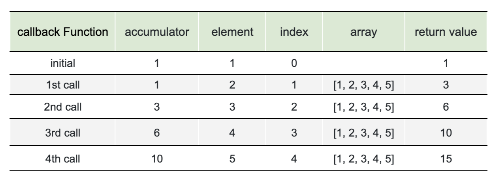
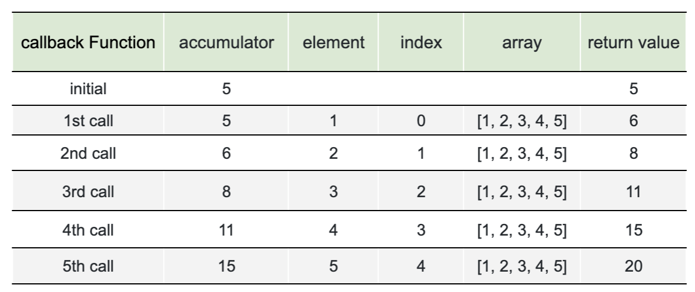
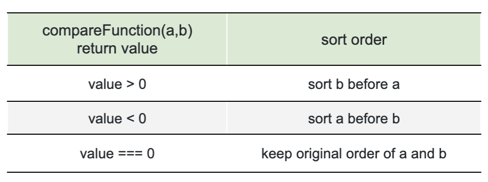
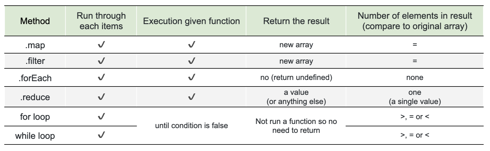
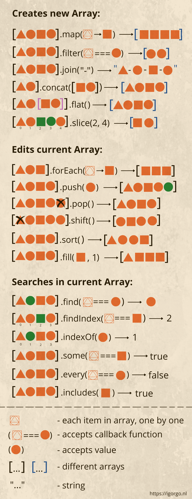

# Array methods

## Introduction

### Array

We have learned about array in the previous lesson. Can you once tell in your word what is an array in Javascript again?

- JavaScript array is a data type specifically for storing **sequences of values**. An array is a special variable, which can hold more than one value at a time.

### Methods

**Methods** are **functions** that allow you to manipulate the value of a particular data type or class.

JavaScript comes with several built-in data types(\*) that **each have their own methods**, that allow you to interact with them in certain ways.

Methods allow you to perform these actions below and manipulate your values.

For example:

- Add or remove an item from an array.
- Or inspect the properties on an object.

For example, methods of

- **String**: [trim()](https://developer.mozilla.org/en-US/docs/Web/JavaScript/Reference/Global_Objects/String/Trim), [split()](https://developer.mozilla.org/en-US/docs/Web/JavaScript/Reference/Global_Objects/String/split), [repeat()](https://developer.mozilla.org/en-US/docs/Web/JavaScript/Reference/Global_Objects/String/repeat)

- **Object**: [keys()](https://developer.mozilla.org/en-US/docs/Web/JavaScript/Reference/Global_Objects/Object/keys), [assign()](https://developer.mozilla.org/en-US/docs/Web/JavaScript/Reference/Global_Objects/Object/assign)

- **Array**: [pop()](https://developer.mozilla.org/en-US/docs/Web/JavaScript/Reference/Global_Objects/Array/pop), [push()](https://developer.mozilla.org/en-US/docs/Web/JavaScript/Reference/Global_Objects/Array/push)

### Array methods

There are many array methods. In this lesson, we will go through some important methods below:

#### Array Iteration Methods

Loop through an existing array and apply a callback function to each element that might mutate each element and return a new value.

WAIT. Can’t we already iterate through arrays with a `for` loop?! Yes, we can often accomplish the same thing using a `for` loop, but the array iteration methods do provide some good benefits!

There are occasional times when it makes more sense to use a for loop over something like a forEach. We'll discuss more about this later.

We'll focus on these methods:

- `forEach(cb)` - Calls the callback function for every element, does not return anything.
- `find(cb)` - Filter elements through the function, return first values that make the function return true.
- `filter(cb)` - Filter elements through the function, return all values that make the function return true.
- `map(cb)` - Creates a new array from results of calling func for every element.
- `reduce(cb, initialValue)` - Calculate a single value over the array by calling func for each element and passing an intermediate result between the calls.

#### Others methods

- `push()` – Insert an element at the end of the array.
- `unshift()` – Insert an element at the beginning of the array.
- `pop()` – Remove an element from the end of the array.
- `shift()` – Remove an element from the beginning of the array.
- `slice()` – Create a shallow copy of an array.
- `splice()` – Add, update, and remove elements in an array.
- `concat()` - Merges one or more arrays and returns a merged array.
- `sort()` - Sorts the array in-place, then returns it.
- `reverse()` - Reverses the array in-place, then returns it.

#### (\*) Build-in data types:

- Primitive types: string, number, boolean, null, undefined
- Composite types: object, array and function (which are all object types)

## Callback Functions

Before jump into the array methods, let's talk about Callback function - a type of function that we mostly use in every array methods.

A callback function is **a function passed into another function as an argument**, which is then invoked inside the outer function to complete some kind of routine or action.

An example of callback functions is the Event Listener function that you pass in the `addEventListener()` function.

Another example is in `setTimeout()` and `setInterval()`:

- `setTimeout(callback, delay, arg1, arg2, ...)` allows us to run a function once after the interval of time.
- `setInterval(callback, delay, arg1, arg2, ...)` allows us to run a function repeatedly, starting after the interval of time, then repeating continuously at that interval.

```javascript
function sayHi(name) {
  console.log(`Hi ${name}`);
}

// This calls sayHi() after one second
setTimeout(sayHi, 1000, "CoderSchool");
```

```javascript
let n = 1;
function counter() {
  console.log(n);
  n = n + 1;
}

// repeat with the interval of one second
let timerId = setInterval(counter, 1000);
// stop after 5 seconds
setTimeout(() => {
  clearInterval(timerId);
}, 5000);
```

### Note:

- A common mistake is adding `()` after the function:
  - `setTimeout(sayHi(), 1000); // wrong`
  - That doesn’t work, because `setTimeout` expects a reference to a function. And here `sayHi()` runs the function, and the result of its execution is passed to `setTimeout`. In our case the result of `sayHi()` is `undefined` (the function returns nothing), so nothing is scheduled.
- The callback function stays in memory until the scheduler calls it or until `clearInterval` is called. So when we don’t need the scheduled function anymore, it’s better to cancel it.
- We will be using callback functions in our array methods. Meaning, for every iteration of the method loop, the function in argument will be call back to execute

## Array iteration methods

Array iteration methods perform some operation on **each element** of array.

### forEach()

The [`array.forEach(callbackFunction)`](https://developer.mozilla.org/en-US/docs/Web/JavaScript/Reference/Global_Objects/Array/forEach) method allows to run a function for every element of the array. The provided function is user defined, it can perform any kind of operation on array.

#### Syntax:

```javascript
array.forEach((item, index, array) => {
  // ... do something with item
});
// index and array are optional
```

Example:

```javascript
const fruit = ["Mango", "Banana", "Orange"];
fruit.forEach((element) => {
  console.log(element);
});
```

Result:

```javascript
Mango;
Banana;
Orange;
```

#### Parameters:

- `callbackFunction`: Function to execute on each element. It accepts between one and three arguments:
  - `element`: The current element being processed in the array
  - `index` (optional): The index of `element` in the array
  - `array` (optional): The array `forEach()` was called upon

```javascript
const fruit = ["Mango", "Banana", "Orange"];
fruit.forEach((element, index, array) => {
  console.log(`${element} is at index ${index} in ${array}`);
  console.log(array);
});
```

Result:

```javascript
Mango is at index 0 in Mango,Banana,Orange
[ 'Mango', 'Banana', 'Orange' ]
Banana is at index 1 in Mango,Banana,Orange
[ 'Mango', 'Banana', 'Orange' ]
Orange is at index 2 in Mango,Banana,Orange
[ 'Mango', 'Banana', 'Orange' ]
```

#### Return value:

`undefined`!
The result of the function (if it returns any) is thrown away and ignored.

#### Converting a for loop to forEach:

We can often achieve the same result with forEach by using for loop. But there some benefit over it. It can be say that forEach is easier to read with a lower chance of accidental errors.

Example:

```javascript
const fruits = ["Mango", "Banana", "Orange"];
const copyFruits = [];

// before
for (let i = 0; i < fruits.length; i++) {
  copyFruits.push(fruits[i]);
}

// after
fruits.forEach((fruit) => {
  copyFruits.push(fruit);
});
```

The example above seems the same in both cases. Let's check another one.

```javascript
const foodArray = [
  { name: "Broken rice", ingredients: ["rice", "pork", "tomato"] },
  { name: "Pho", ingredients: ["noodle", "beef", "broth"] },
  {
    name: "Crispy Vietnamese Crêpes",
    ingredients: ["rice flour", "shrimp", "coconut cream"],
  },
];

for (let i = 0; i < foodArray.length; i++) {
  let food = foodArray[i];
  console.log(food.name);
  for (let j = 0; j < food.ingredients.length; j++) {
    let ingredient = food.ingredients[j];
    console.log(ingredient);
  }
}
```

Result:

```javascript
Broken rice //name
rice
pork
tomato
Pho //name
noodle
beef
broth
Crispy Vietnamese Crêpes //name
rice flour
shrimp
coconut cream
```

Having those two i and j variable add a lot confusion to your code.
Here is the result using forEach instead:

```javascript
const foodArray = [
  { name: "Broken rice", ingredients: ["rice", "pork", "tomato"] },
  { name: "Pho", ingredients: ["noodle", "beef", "broth"] },
  {
    name: "Crispy Vietnamese Crêpes",
    ingredients: ["rice flour", "shrimp", "coconut cream"],
  },
];

foodArray.forEach((food) => {
  console.log(food.name);
  food.ingredients.forEach((ingredient) => {
    console.log(ingredient);
  });
});
```

Read more about other reason why we use one over other [here](https://alligator.io/js/foreach-vs-for-loops/).

### find()

Imagine we have an array of objects. How do we find an object with the specific condition?

Here the [array.find(cb)](https://developer.mozilla.org/en-US/docs/Web/JavaScript/Reference/Global_Objects/Array/find) method comes in handy.

#### Syntax

```javascript
let result = array.find(function (item, index, array) {
  // if true is returned, item is returned and iteration is stopped
  // for falsy scenario returns undefined
});
```

Example: find an object user in the users array that has the id equal to 1

```javascript
let users = [
  { id: 1, name: "John" },
  { id: 2, name: "Pete" },
  { id: 3, name: "Mary" },
];

let user = users.find((item) => item.id == 1);

console.log(user); // { id: 1, name: "John" }
```

#### Parameters:

- `callbackFunction`: Function to execute on each element. It accepts between one and three arguments:
  - `element`: The current element being processed in the array
  - `index` (optional): The index of `element` in the array
  - `array` (optional): The array `forEach()` was called upon

#### Return value:

- If the `callbackFunction` return true, the `find()` method will returns the **value of first element** in the provided array that match with the provided function
- If the `callbackFunction` return false, `undefined` is returned

In real life arrays of objects is a common thing, so the `find()` method is very useful.

The [array.findIndex()](https://developer.mozilla.org/en-US/docs/Web/JavaScript/Reference/Global_Objects/Array/findIndex) method is essentially the same, but it returns the index where the element was found instead of the element itself and -1 is returned when nothing is found.

---give more example to emphasize the case that return only first element

### filter()

The `find()` method looks for a _single (first) element_ that makes the function return true.

If there may be many, we can use [array.filter(cb)](https://developer.mozilla.org/en-US/docs/Web/JavaScript/Reference/Global_Objects/Array/filter).

The syntax is similar to `find()`, but `filter()` returns **an array of all matching elements**:

#### Syntax

```javascript
let results = array.filter(function (element, index, array) {
  // if true element is pushed to results and the iteration continues
  // returns empty array if nothing found
});
```

Example: find all the object users that has the `id` lower than 3

```javascript
let users = [
  { id: 1, name: "John" },
  { id: 2, name: "Pete" },
  { id: 3, name: "Mary" },
];

// returns array of the first two users
let someUsers = users.filter((element) => element.id < 3);

console.log(someUsers);
```

---- result image, running a test case for explanation

Result:

```javascript
[
  { id: 1, name: "John" },
  { id: 2, name: "Pete" },
];
```

#### Parameters:

- `callbackFunction`: Function to execute on each element. It accepts between one and three arguments:
  - `element`: The current element being processed in the array
  - `index` (optional): The index of `element` in the array
  - `array` (optional): The array `forEach()` was called upon

#### Return value:

- Create a **new array**
- If the `callbackFunction` return true, the **element is pushed** to that new array and the iteration continues till the end of the filtered array
- If the `callbackFunction` return false, **empty array** is returned

### map()

The [array.map(cb)](https://developer.mozilla.org/en-US/docs/Web/JavaScript/Reference/Global_Objects/Array/map) method is one of the most useful and often used.

It calls the function for each element of the array and returns the array of results.

#### Syntax

```javascript
let result = array.map(function (element, index, array) {
  // returns the new value instead of element
});
```

Example:

```javascript
let array = ["Mango", "Banana", "Orange"];
let lengths = array.map((element) => element.length);
console.log(lengths); // [5, 6, 6]
```

#### Parameters:

- `callbackFunction`: Function to execute on each element. It accepts between one and three arguments:
  - `element`: The current element being processed in the array
  - `index` (optional): The index of `element` in the array
  - `array` (optional): The array ` map()` was called upon

#### Return value:

- Create a **new array**
- Each element in the new array is the return value of the `callbackFunction`

### reduce()

The method [array.reduce(cb)](https://developer.mozilla.org/en-US/docs/Web/JavaScript/Reference/Global_Objects/Array/reduce) is used to calculate a single value based on the array.

#### Syntax

```javascript
let value = array.reduce((accumulator, element, index, array) => {
  // ...
}, initialValue);
```

The function is applied to all array elements one after another and “carries on” its result to the next call.

Example: without `initialValue`

```javascript
let arr = [1, 2, 3, 4, 5];

let result = array.reduce((sum, current) => sum + current);

console.log(result); // 15
```

This callback Function invoke 4 times because there is **no** `initialValue`.

Therefore the accumulator is initialized to the first value in the array.


Example: with `initialValue`

```javascript
let arr = [1, 2, 3, 4, 5];

let result = array.reduce((sum, current) => sum + current, 5);

console.log(result); // 15
```

This callback Function invoke 4 times because there is `initialValue`. Therefore the `element` initialized to the first value in the array


#### Parameters:

- `callbackFunction`: Function to execute on each element. It accepts between one and four arguments:
  - `accumulator`: is the result of the previous function call, equals `initialValue` the first time (if `initialValue` is provided).
  - `element`: The current element being processed in the array
  - `index` (optional): The index of `element` in the array
  - `array` (optional): The array ` map()` was called upon
- `initialValue` (optional): A value to which accumulator is initialized the first time the callback is called.
  - If `initialValue` is specified, that also causes `element` to be initialized to the first value in the array.
  - If `initialValue` is not specified, accumulator is initialized to the first value in the array, and `element` is initialized to the second value in the array.

#### Return value:

**The value** results from running the `callbackFunction` through entire array.

**Another example**: sum of value in an object array

```javascript
let cart = [
  { id: 1, name: "Banana", price: 0.5, quantity: 5 },
  { id: 2, name: "Mango", price: 1.5, quantity: 3 },
  { id: 3, name: "Orange", price: 0.9, quantity: 7 },
];

let totalPrice = cart.reduce(
  (total, item) => total + item.price * item.quantity,
  0
);
console.log(totalPrice); // $13.3
```

The method [array.reduceRight()](https://developer.mozilla.org/en-US/docs/Web/JavaScript/Reference/Global_Objects/Array/reduceRight) does the same, but goes from right to left.

## sort() and reverse()

### sort()

The call to [array.sort(compareFunction)](https://developer.mozilla.org/en-US/docs/Web/JavaScript/Reference/Global_Objects/Array/sort) sorts the array in place, changing its element order.

It also returns the sorted array, but the returned value is usually ignored, as array itself is modified.

#### Syntax:

```javascript
array.sort(compareFunction(a, b)); // return a sorted array
//compareFunction is optional
```

#### Without compareFunction

Example:

```javascript
let arr = [1, 2, 15];

// the method reorders the content of array
array.sort();

console.log(arr); // 1, 15, 2
```

The order became `1, 15, 2`, because the items are **sorted as strings** by default. For string `"2" > "15"` indeed.

#### With compareFunction

CompareFunction take two arguments: firstElement and secondElement for comparison.
The value return from the compareFunction decides the order of elements in the array.
The compare function should return a negative, zero, or positive value



- Sort a **list of objects** base on one of the attributes.

  Example:

  ```javascript
  let users = [
    { id: 1, name: "John", age: 32 },
    { id: 2, name: "Pete", age: 14 },
    { id: 3, name: "Mary", age: 60 },
  ];

  users.sort((userA, userB) => {
    if (userA.age > userB.age) {
      return 1; // sort userB before userA
    }
    if (userA.age === userB.age) {
      return 0; // keep original order of userA and userB
    }
    if (userA.age < userB.age) {
      return -1; // sort userA before userB
    }
  });

  console.log(users);
  ```

  Result:

  ```javascript
  [
    { id: 2, name: "Pete", age: 14 },
    { id: 1, name: "John", age: 32 },
    { id: 3, name: "Mary", age: 60 },
  ];
  ```

- To sort **numerical values**, we can do:

  ```javascript
  array.sort((a, b) => a - b);
  ```

  Example:

  ```javascript
  const numbers = [4, 2, 5, 1, 3];
  numbers.sort((a, b) => {
    return a - b;
  });
  console.log(numbers); //[1, 2, 3, 4, 5]

  numbers.sort((a, b) => {
    return b - a;
  });
  console.log(numbers); //[5, 4, 3, 2, 1]
  ```

#### Parameters:

- `compareFunction` (Optional):
  - If there is no `compareFunction`:
    - The array elements are converted to strings
    - Then sorted according to each character's Unicode code point value
  - A function that defines the sort order. This function take two arguments:
    - `firstElement`: the first element for comparison
    - `secondElement`: the second element for comparison

#### Return value:

- The sorted array.
- Note that the array is sorted in place, and **no copy is made**.

### reverse()

A method reverses an array in place. The first array element becomes the last, and the last array element becomes the first.

##### Syntax:

```javascript
array.reverse();
```

Example:

```javascript
const fruits = ["Mango", "Orange", "Avocado", "Lemon", "Lychee"];

const fruitCount = fruits.reverse();

console.log(fruitCount); // [ 'Lychee', 'Lemon', 'Avocado', 'Orange', 'Mango' ]
console.log(fruits); // [ 'Lychee', 'Lemon', 'Avocado', 'Orange', 'Mango' ]
```

#### Return value:

- A reversed array
- And the original array also reverses

## Comparison of some common iteration array methods:



## Other methods

### toString()

A method convert array to string.

##### Syntax:

```javascript
array.toString();
```

Example:

```javascript
const fruits = ["Mango", "Orange", "Apple"];
const fruitString = fruits.toString();
console.log(fruitString); //Mango,Orange,Apple
```

##### Return value:

- A string of array values (comma separated)
- `arrayl.length === 0` , return empty string

### join()

Also a method "join" array to string, but this time, you can specify the separator

##### Syntax:

```javascript
array.join();
```

Example:

```javascript
const fruits = ["Mango", "Orange", "Apple"];
const fruitString = fruits.join("-");
console.log(fruitString); //Mango-Orange-Apple
```

##### Return value:

- A string of array values (with specified separator)
- `arrayl.length === 0` , return empty string

**Transform the array:**

### push()

A method that adds one or more elements to the end of an array and return a length of the array

##### Syntax:

```javascript
array.push(element1, element2,..., elementN)
```

Example:

```javascript
const fruits = ["Mango", "Orange"];

const fruitCount = fruits.push("Avocado");

console.log(fruitCount); // 3
console.log(fruits); // [ 'Mango', 'Orange', 'Avocado' ]

fruits.push("Lemon", "Lychee");

console.log(fruits); //[ 'Mango', 'Orange', 'Avocado', 'Lemon', 'Lychee' ]
```

#### Parameters

- `elementN`: the element(s) to add to the end of array

#### Return value:

- The `length` property of the array upon with the method was called

#### unshift()

`unshift()` is a method just like `push()` but instead of adding an element to the end of an array, `unshift()` add an element to the beginning of an array. Read more about shift [here](https://developer.mozilla.org/en-US/docs/Web/JavaScript/Reference/Global_Objects/Array/unshift)

---

### pop()

A method that removes the last element from an array and returns that element

#### Syntax:

```javascript
array.push(element1, element2,..., elementN)
```

Example:

```javascript
const fruits = ["Mango", "Orange", "Avocado", "Lemon"];

const removeFruit = fruits.pop();

console.log(removeFruit); // Lemon
console.log(fruits); // [ 'Mango', 'Orange', 'Avocado' ]
```

#### Return value:

- The removed element from the array
- Return the removed element

#### shift()

`shift()` is a method just like `pop()` but instead of removing the last element from an array, `shift()` remove the first element. Read more about shift [here](https://developer.mozilla.org/en-US/docs/Web/JavaScript/Reference/Global_Objects/Array/shift)

---

### slice()

- A method that return a shallow copy of a portion of an array into a **new array** selected from `startIndex` to `endIndex` (end not included).
- `startIndex` and `endIndex` represent the index of items in that array.
- The original array will **not be modified**.

##### Syntax:

```javascript
array.slice(startIndex, endIndex);
```

Example:

```javascript
const fruits = ["Mango", "Orange", "Avocado", "Lemon"];

const sliceFruit1 = fruits.slice(2);
console.log(sliceFruit1); //[ 'Avocado', 'Lemon' ]

const sliceFruit2 = fruits.slice(1, 3);
console.log(sliceFruit2); //[ 'Orange', 'Avocado' ]

const sliceFruit3 = fruits.slice(-3);
console.log(sliceFruit3); //[ 'Orange', 'Avocado', 'Lemon' ]

const sliceFruit4 = fruits.slice(2, -1);
console.log(sliceFruit4); //[ 'Avocado' ]
```

##### Parameters:

- startIndex (optional): index at which to start extraction
- endIndex (optional): index before at which to end extraction

##### Return value:

- Create a new array that contain the extracted elements

### splice()

A method modify the contents of an array by

- removing
- replacing existing elements
- and/or adding new elements in place

##### Syntax:

```javascript
array.splice(startIndex, deleteCount, item1, item2,...,itemN)
```

Example:

```javascript
const fruits = ["Mango", "Orange", "Avocado", "Lemon"];

const spliceFruit1 = fruits.splice(1, 0, "Apple"); //insert at index 1
console.log(spliceFruit1); //[ ]
console.log(fruits); //[ 'Mango', 'Apple', 'Orange', 'Avocado', 'Lemon' ]

const spliceFruit2 = fruits.splice(3, 2, "Lychee"); //remove 2 elements from index 2 and add Lychee to index 3
console.log(spliceFruit2); //[ 'Orange', 'Avocado' ]
console.log(fruits); // [ 'Mango', 'Apple', 'Lychee', 'Lemon' ]
```

##### Parameters:

- `startIndex`: index at which to start extraction
- `deleteCount` (optional): number of elements to remove from `startIndex`
- `item1, item2,...,itemN` (optional): the elements to add, start from `startIndex`. If there is no item, `splice()` will only remove

##### Return value:

- An array of removed elements from the array

---

### concat()

A method use to merge two or more arrays and return a new array

##### Syntax:

```javascript
array.concat(value1,..., valueN) // valueN can be arrays or values
```

Example:

```javascript
const fruit1 = ["Mango", "Orange"];
const fruit2 = ["Strawberry", "Coconut", "Lemon"];
const fruit3 = ["Kiwi"];

const mergeFruit = fruit1.concat(fruit2);
console.log(mergeFruit); //[ 'Mango', 'Orange', 'Strawberry', 'Coconut', 'Lemon' ]

const mergeFruit2 = fruit1.concat(fruit2, fruit3);
console.log(mergeFruit2); //[ 'Mango', 'Orange', 'Strawberry', 'Coconut', 'Lemon', 'Kiwi' ]

const addSingleFruit = mergeFruit.concat("Kiwi");
console.log(addSingleFruit); //[ 'Mango', 'Orange', 'Strawberry', 'Coconut', 'Lemon', 'Kiwi' ]
```

##### Parameters:

- `valueN`: can be arrays or value

##### Return value:

- A new merged array

## Converting between array, string and object

### Convert string to array:

#### split()

- A method method divides a String into an _ordered list of substrings_
- Then puts these substrings into an array, and returns the array.
- The division is done by searching for a **pattern**;
- The pattern is provided as the first **parameter** in the method's call.

##### Syntax:

```javascript
string.split(separator, limit);
```

Example:

```javascript
const randomString = "Hello World! A new day has come.";

//a space " " is the pattern
const stringArray = randomString.split(" ");
console.log(stringArray); //[ 'Hello', 'World!', 'A', 'new', 'day', 'has', 'come.' ]

const randomString2 = "Hello-World! A-new-day-has-come.";
//"-" is now the pattern that split looking for
const stringArray2 = randomString2.split("-");
console.log(stringArray2); //[ 'Hello', 'World! A', 'new', 'day', 'has', 'come.' ]

const stringArray3 = randomString.split("");
console.log(stringArray3)[
  ("H",
  "e",
  "l",
  "l",
  "o",
  " ",
  "W",
  "o",
  "r",
  "l",
  "d",
  "!",
  " ",
  "A",
  " ",
  "n",
  "e",
  "w",
  " ",
  "d",
  "a",
  "y",
  " ",
  "h",
  "a",
  "s",
  " ",
  "c",
  "o",
  "m",
  "e",
  ".")
];

const stringArray4 = randomString.split("", 3);
console.log(stringArray4)[("H", "e", "l")];
```

##### Parameters:

- `separator`: The **pattern** describing where each split should occur.
  The separator can be a simple string or it can be a [regular expression](https://developer.mozilla.org/en-US/docs/Web/JavaScript/Guide/Regular_Expressions).
- `limit` (optional): A non-negative integer specifying a limit on the number of substrings to be included in the array

##### Return value:

- A new array of substrings

#### Spread syntax

This spread syntax allows an iterable such as an array expression or string to be expanded in places. We'll learn more about this later. Read more [here](https://developer.mozilla.org/en-US/docs/Web/JavaScript/Reference/Operators/Spread_syntax)
Example:

```javascript
const randomString = "Hello World! A new day has come.";
const stringArray = [...randomString]; //[ 'H','e','l','l','o',' ','W','o','r','l','d','!',' ','A',' ','n','e','w',' ','d','a','y',' ','h','a','s',' ','c','o','m','e','.' ]
```

### Convert string to array:

There are 3 methods we can use here

#### Object.keys()

A method returns an array of all keys in the object
Example:

```javascript
const user = {
  firstName: "Jon",
  lastName: "Snow",
  email: "jonstark@gmail.com",
};

const userKey = Object.keys(user);
console.log(userKey); // [ 'firstName', 'lastName', 'email' ]
```

#### Object.values()

A method returns an array of all values in the object
Example:

```javascript
const user = {
  firstName: "Jon",
  lastName: "Snow",
  email: "jonstark@gmail.com",
};

const userValue = Object.values(user);
console.log(userValue); // [ 'Jon', 'Snow', 'jonstark@gmail.com' ]
```

#### Object.entries()

A method returns an array of [key, value] pairs from the given object
Example:

```javascript
const user = {
  firstName: "Jon",
  lastName: "Snow",
  email: "jonstark@gmail.com",
};

const userValue = Object.entries(user);
console.log(userValue);
```

Result:

```javascript
[
  ["firstName", "Jon"],
  ["lastName", "Snow"],
  ["email", "jonstark@gmail.com"],
];
```

## Cheat Sheet


