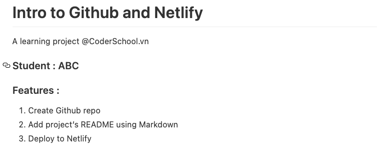

# Github and Netlify

## Overview

Recently in the course, we have been built all the websites using codepen.io or codesanbox.io. But things are moving to local (your laptop), everything by now is built and tested locally. So, what if we want to share our work with our friends or our dear mentors? Netlify and Github are here to help.

In short, a web project is made of 2 parts : the codebase and the production of that code. With codepen.io or codesanbox.io, all of them are in one place which make it easier for beginners to start fast. But, we are no beginner, we want to utlize our machine power and indepent from internet hiccup to code locally ; then deploy (publish) our work later when neccessary.

## About Gihub

### Online codebase on Github

The local codebase live in your machine, only you have the access. To push your code to Github is simply create an online version of your code availble in case of water spill on laptop. An online repository on Github will help you to :

- Add collaborators and get help around the world
- Safe from accidents happen to your machine
- Allow other services (Netlify) to access your code 24/7. (Fact : CodeSanbox website will sleep after 30 minutes. Surely Facebook should not host on Codesandbox)
- Join a network of other amazing devs like you

### Quickstart Github

1. Sign-up for Github account [Github website](https://github.com/)
2. Create a repository [Get start create your first Github repository here](https://docs.github.com/en/get-started/quickstart/create-a-repo) _Tip: You could learn more about Github in that guide_

## About Netlify

### Online production on Netlify

[Netlify](https://www.netlify.com/) is a web hosting infrastructure and automation technology company. Netlify simplifies the process of deploying your website. It does all the work for us that we probably don't want to spend too much time or effort on. Netlify works by connecting to your GitHub repository to pull your source code, then it typically runs a build process to pre-render all of your pages in static HTML. Hosting a website on Netlify means :

- Globally hosting your project online (No more sending `http://localhost` to your friends )
- Update Github codebase can trigger update of the actual website
- Configure to hide sensitive infos (API keys, Services password, Cheat code for game)
- Change domain name.
- Free !

### Quickstart Netlify

1. Sign-up a Netlify account :First thing first, get to the site [Netlify](https://www.netlify.com/) and sign up with your github account. This will help Netlify connect automatically to your Github account for fastest deploying experiences.
2. Follow exercise bellow to deploy your first project to Netlify

## Exercise : Hello World

### A/ Create a Github repo from scratch

- Milestone 1: Open a fresh directory with no git history (_hint: make a new dir that not under any git dir_)
- Milestone 2: Add HTML, CSS and JS file
- Milestone 3: In HTML add Heading 1 as Hello world !
- Milestone 4: In CSS change `world` to a different color
- Milestone 5: In JS , add code so that your name also show on the web.
- Milestone 6: Follow [This guide](https://kbroman.org/github_tutorial/pages/init.html) to make a Github repo from an fresh local directory
- Milestone 7: Add a README.md file that look like this using [Markdown guide](https://www.markdownguide.org/basic-syntax/)

- Milestone 8: Update the Github repo

### B/ Deploy to netlify

- Milestone 1: First thing first, get to the site [Netlify](https://www.netlify.com/) and sign up with your github account

- Milestone 2: Let's follow the step from [this](https://www.netlify.com/blog/2016/09/29/a-step-by-step-guide-deploying-on-netlify/) to deploy your website

## Assignment : Your CV on Netlify

1. Let get your CV site from previous HTML CSS course live!
2. Then share it to your Facebook (or Instagram).
3. The total points from your post (like + 1 point and share + 3 points) will be your score on this assignment! 😉
4. Submit your Github repo both Netlify production links.

<small>
  {" "}
  Jks, you don't have to share your CV on Facebook. Just submit your assignment here
  😉 Have fun deploying!{" "}
</small>
